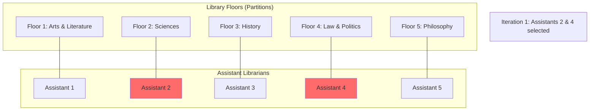
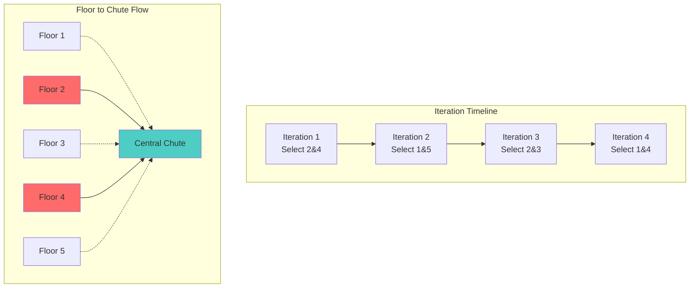
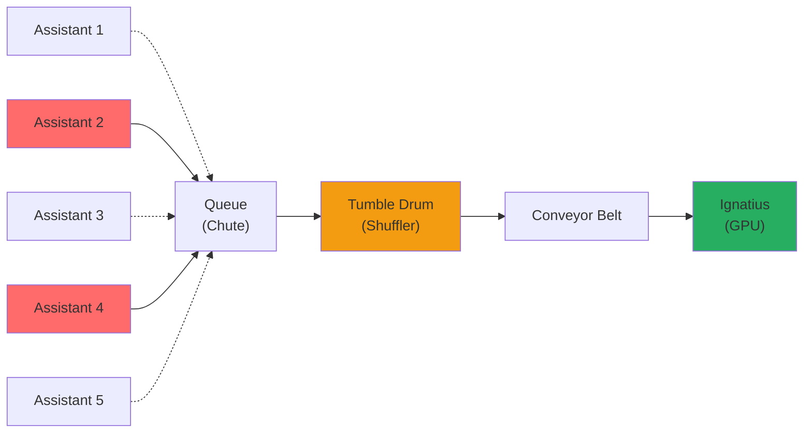

# Blazing Fast Dataloaders #2: Ignatius takes a trip to the Library of Congress

Remember Ignatius O'Reilly from _A Confederacy of Dunces_? Voracious, impatient, impressionable, perambulatorily challenged? That's modern neural network pretraining on GPUs.

Ignatius's traits map perfectly to GPU training challenges:

- **Voracious**: Insatiable appetite for data at massive scale
- **Impatient**: Can't tolerate delays—any idle time is expensive compute waste
- **Impressionable**: Easily biased by whatever patterns it encounters first
- **Perambulatorily challenged**: Can't move to the data; everything must be streamed directly to it

What if, instead of wandering the streets of New Orleans, Ignatius spent his days in the Library of Congress? And what if you were the only librarian who could tend to his endless demands? That's the challenge of dataloader design.

In our previous post on SLAF dataloaders, we tackled voraciousness (scale), impatience (throughput), and perambulation (streaming). Today, let's examine impressionability—and why it's the trickiest challenge of all.

## The Library and Its Readers

Picture the Library of Congress: a vast, modern institution housing millions of books (your data) meticulously organized across multiple floors (partitions). Every book is catalogued alphabetically by topic, author, and title (your indexing schema), creating a systematic way to locate any piece of information quickly.

You are the sole librarian (query engine) responsible for serving three distinctly different types of readers (query patterns), each with their own peculiar demands:

### The Three Types of Readers

**1. The Impatient Wanderer**
This reader bursts through the doors with a specific agenda: they need exactly 5 books on diverse topics—medieval poetry, quantum mechanics, cookbook recipes, legal precedents, and art history—and they need them _now_. They want to read just a few pages from each before moving on to their next random assortment.

!!! info "In Technical Terms"

    Interactive applications, real-time dashboards, chat interfaces. These require filtering tiny subsets of data with random access patterns, demanding ultra-low latency responses.

**2. The Diligent Specialist**
This reader has a laser focus: they want to know the publication year of every single book in the library—nothing more, nothing less. They're methodical, patient, and willing to wait for comprehensive results. They don't mind if it takes hours, as long as they get complete coverage.

!!! info "In Technical Terms"

    Batch processing pipelines, analytics workloads, aggregation queries. These scan entire datasets with column-specific operations, optimizing for throughput over latency.

**3. The Impressionable Voracious Reader (Ignatius)**
This is our GPU: they want to read every book in the library, cover to cover, as fast as possible. But here's the critical constraint: they're highly impressionable. If they encounter all the poetry books first, they might develop an unconscious bias toward flowery language. If they read all the legal texts together, they might start thinking everything is a contract dispute. They need books delivered in a carefully randomized order to avoid these biases, but they also can't wait around: they need a steady stream of books arriving at their reading desk.

!!! info "In Technical Terms"

    Neural network training workloads that require high-throughput streaming of randomized data to prevent model bias while maintaining GPU utilization.

### What's Within the Librarian's Control

As the resourceful librarian, you have several tools at your disposal:

- **Query optimization**: You can choose the most efficient path through the library
- **Caching strategies**: You can anticipate requests and pre-position books
- **Resource allocation**: You can decide how to distribute your time and energy
- **Delivery methods**: You can design clever systems to transport books to readers

### What's Beyond the Librarian's Control

However, you face significant constraints that you cannot change:

- **The library architecture**: Floors, rooms, and basic layout are fixed
- **The cataloging system**: Books are organized alphabetically by topic/author/title—you can't reorganize the entire collection
- **Storage format**: Books are stored as books, not reorganized into reader-specific formats
- **Physical infrastructure**: You can't rebuild the building or add new wings

!!! info "Technical Constraints"

    You can't change the underlying data schema, create additional indexes (too expensive), pre-shuffle the entire dataset (violates "store once, query many" principle), or reorganize partitions for specific workloads.

The challenge becomes clear: how do you serve Ignatius's need for randomized, high-throughput data delivery while working within these constraints? You need to be resourceful, not revolutionary.

This is where the librarian's ingenuity shines: building a clever contraption within the existing constraints to solve the impossible problem.

## The Librarian's Contraption: Assistant Librarians, Chutes, and Tumble Drums

Faced with Ignatius's impossible demands, our resourceful librarian devises an ingenious solution: a mechanical contraption that delivers randomized books at high throughput without reorganizing the library.

The system works through three coordinated components that operate continuously in the background:

### The Assistant Librarians (Scanners)

Rather than running around the library herself, our librarian employs assistant librarians, one stationed on each floor. But here's the clever part: at each moment in time, only a randomly selected subset of assistants are active.

Imagine 5 floors in our library, each with an assistant. At each iteration, the librarian randomly selects 2 assistants to collect books. This random selection is the "mixture" in "mixture of scanners": different assistants contribute to the book stream at different times, ensuring no systematic bias toward any particular floor's content.



Each active assistant collects books in the most efficient way possible: **contiguous sequences** from their floor. Rather than randomly jumping around their floor (which would be slow), they grab books from consecutive shelves. This is crucial for performance.

!!! info "The Lance Advantage"

    Here's where our choice of storage format matters enormously. Unlike traditional formats (like Parquet) that organize data into fixed "row groups," Lance has no such constraints. This means our assistants can read truly contiguous sequences of any size from their partition, maximizing I/O efficiency. With Parquet, assistants would be forced to read in predetermined chunk sizes, often fetching unwanted data or making multiple I/O calls.

### The Chute System (Queue)

As assistants collect their books, they don't deliver them directly to Ignatius. Instead, they drop books down a pneumatic chute system that connects all floors to a central processing area. This chute (the async queue) serves two critical functions:

1. **Buffering**: Books from different floors arrive at different times, but the chute stores them temporarily
2. **Mixing**: Books from Floor 2 (Sciences) and Floor 4 (Law) arrive in the same chute, beginning the randomization process



### The Tumble Drum (Shuffling Mechanism)

Here's where the magic happens. Before books reach Ignatius, they pass through a tumble drum, like a clothes dryer that thoroughly mixes the books from different floors and different time periods. This mechanical shuffling ensures that:

- A science book from Iteration 1 might be delivered alongside a literature book from Iteration 3
- Books that were stored next to each other on the same floor are now separated
- Ignatius receives a truly randomized stream despite the systematic collection process



The librarian's contraption runs continuously:

1. **Every few seconds**: Randomly select which assistants should collect books
2. **Assistants work in parallel**: Each reads a contiguous sequence from their floor
3. **Books flow into the chute**: Mixed timing creates natural diversity
4. **Tumble drum activates**: Mechanical shuffling adds final randomization
5. **Steady delivery**: Ignatius receives randomized books at a consistent, high rate

The key insight is that randomization happens in the **delivery mechanism**, not in the storage organization. The library maintains its efficient alphabetical organization, but the contraption ensures Ignatius gets the randomized experience he needs to avoid bias.

This system is configurable: in practice, you might have 50 floors (partitions) with 5–10 assistants active per iteration, but the principle remains the on-the-fly randomness through query-engine design rather than storage reorganization.

## Ignatius Gets His Books: Real-World Results

Now comes the crucial question: does this elaborate contraption actually deliver on its promise? Does Ignatius get the randomized reading experience he needs while maintaining the throughput he demands?

To answer this, we need to measure two things: **randomness quality** (how unbiased is the book delivery?) and **delivery speed** (does the contraption keep up with Ignatius's voracious appetite?).

### Measuring Randomness: The Library Distance Test

To measure how random our book delivery truly is, we developed a clever test that doesn't require knowing anything about the books' contents. Instead, we look at the "distance" between book locations in the library.

Think of it this way: if our contraption is working properly, books that end up in the same delivery batch should come from vastly different parts of the library. A batch containing books from shelf 1, shelf 50,000, shelf 120,000, and shelf 300,000 indicates good randomization. A batch with books from shelves 1, 2, 3, and 4 suggests our system isn't mixing well enough.

We measured this using **L1 distance**: essentially, how far apart the book locations are numerically. We tested this across 10,000 delivery batches (32 books each) from our 5.4 million book library.

### The Three Strategies: Lazy, Fragmented, and Resourceful

We compared our mixture of scanners contraption against two simpler approaches:

!!! info "The Lazy Sequential Librarian"

    Our baseline: a librarian who simply walks through the library in order, floor by floor, shelf by shelf. This represents the most efficient but least random approach—books in each batch come from consecutive shelves.

!!! info "The Floor Stepper"

    A slightly cleverer approach that reads larger contiguous chunks—entire floors at a time rather than just a few shelves. The tumble drum can then achieve better block-wise randomization (good mixing within each floor's books, but floors are still processed sequentially).

!!! success "The Resourceful Contraption (Mixture of Scanners)"

    Our full system with assistant librarians, chutes, and tumble drums working together to create maximum randomization while maintaining efficiency.

### The Results: Near-Perfect Randomization

Here's how each approach performed in our library distance test:

**Randomness Measurement (L1 Distance Between Book Locations)**

| Strategy                     | Within-Batch Distance | Across-Batch Distance |
| ---------------------------- | --------------------- | --------------------- |
| Sequential (Lazy)            | 94.1                  | 104.5                 |
| Floor Stepping               | 1,643.5               | 1,672.6               |
| Mixture of Scanners (MoS)    | 1,608,648.2           | 1,642,829.9           |
| Perfect Random (Theoretical) | 1,828,595.2           | 1,824,468.9           |

**Normalized Entropy Scores (0 = Sequential, 1 = Perfect Random)**

| Strategy                  | Within-Batch Score | Across-Batch Score |
| ------------------------- | ------------------ | ------------------ |
| Sequential (Lazy)         | 0.000              | 0.000              |
| Floor Stepping            | 0.001              | 0.001              |
| Mixture of Scanners (MoS) | 0.880              | 0.900              |

!!! success "Near-Perfect Randomization"

    Our contraption achieves **88-90% of theoretical maximum randomness**—nearly indistinguishable from perfect random selection! This means books in Ignatius's batches come from wildly different parts of the library, preventing any systematic bias.

The beautiful part is that this randomization comes with minimal throughput cost:

**Delivery Throughput Results**

| Strategy                  | Throughput (books/sec) | Performance vs Sequential |
| ------------------------- | ---------------------- | ------------------------- |
| Sequential (Lazy)         | 23,728                 | 100% (baseline)           |
| Fragment Hopping          | 26,769                 | 113% (slightly faster)    |
| Mixture of Scanners (MoS) | 22,972                 | 97% (nearly identical)    |

!!! success "Speed Without Sacrificing Throughput"

    Our contraption delivers books at **97% the speed of the simple sequential approach** while achieving **88-90% of perfect randomization**. This breaks the traditional speed-vs-randomness tradeoff that has plagued library science for decades.

### Why the Contraption Works So Well

!!! info "Why the Contraption Works So Well"

    The magic lies in the multi-layered randomization working together:

    1. **Scanner Selection Randomness**: Randomly choosing which assistant librarians are active ensures books come from different floors
    2. **Starting Point Variety**: Each active assistant begins from a different point on their floor
    3. **Temporal Mixing**: The chute system means books collected in different rounds get mixed together
    4. **Tumble Drum Shuffling**: Final mechanical mixing ensures even books collected consecutively are delivered in random order

The result: Ignatius gets books that are scattered across the entire library—a medieval poetry book might be followed by quantum mechanics, then a cookbook, then legal precedents—exactly the unpredictable sequence he needs to avoid developing reading biases.

!!! success "Ready to Use"

    The mixture of scanners approach is available to use and is the default `SLAFDataLoader` option as of `v0.3.0`.

First, install SLAF with ML support:

```bash
pip install "slafdb[ml]>=0.3.0"
```

Then use the mixture of scanners approach:

```python
from slaf.core.slaf import SLAFArray
from slaf.ml.dataloaders import SLAFDataLoader

# Load your single-cell dataset
slaf_array = SLAFArray("path/to/dataset.slaf")

# Create dataloader with mixture of scanners (maximum entropy)
dataloader = SLAFDataLoader(
    slaf_array=slaf_array,
    batch_size=32,
    n_epochs=1000,
    raw_mode=True,
    n_scanners=16,                 # Number of assistant librarians
    prefetch_batch_size=4194304,   # How many book pages they fetch at once: 4M rows for MoS
)

# Ignatius gets his randomized books
for batch in dataloader:
    train_step(model, batch)
```

For a more comprehensive performance comparison against other state-of-the-art dataloaders, benchmarks are available at: https://slaf-project.github.io/slaf/benchmarks/ml_benchmarks/
