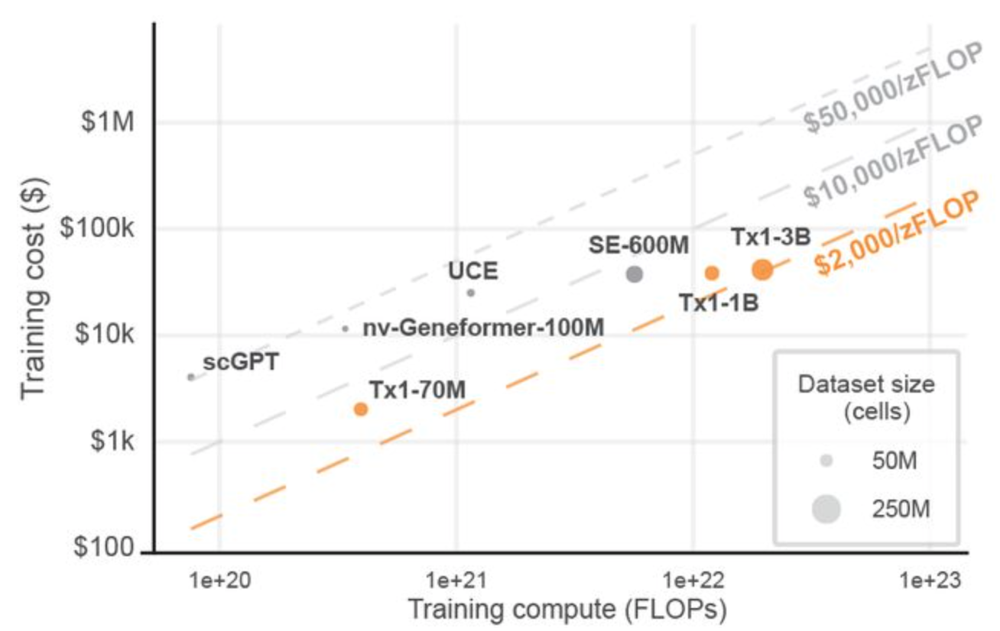

# Pretraining scGPT on Tahoe-100M for ~&#36;10 over a lunch break

## How distributed dataloading changes the economics of single-cell foundation models

How do you get better ideas? In science, progress is often bounded
by how many *distinct* hypotheses a community can afford to test. Two levers
matter: (1) raise the number of serious tries per unit time and money,
and (2) lower the barrier to entry so more people can run those tries at
all. *After* finding and pulling those levers, fields tend to make qualitative jumps.

Single-cell foundation models are still on the wrong side of  both levers.
Too few people are testing too few architectures, objectives, and
data regimes per year and it largely comes down to the fact that training
a credible model is a five-figure, multi-day GPU commitment.
If you look beyond wall-clock training, there is cluster reservations,
scaling-law planning, and training data staging. Each run feel like a launch campaign.
When every experiment is expensive in calendar time and cognitive overhead, the
search for better foundation models, better virtual cells, and better
science slows down for everyone, not only for small labs.

How do you collapse the cost, calendar, and operational overhead so
the field gets **100×** more shots on goal? That is the
subject of this post.

- We explain why dataloaders sit on the critical path once data is no longer on local disk, and recap the design patterns that got SLAF's dataloader to SOTA single-node throughput ([Section 1](#section-1)).

- We argue for object-storage-native training ([Section 2](#section-2)) and show that traditional throughput ceilings can be overcome by reimagining the dataloader as a pubsub-like distributed system ([Section 3](#section-3)).

- We show how **`DistributedSLAFDataLoader`**, a realization of this idea, achieves unprecedented training throughput by decoupling CPU ingestion from GPU training ([Section 4](#section-4)).

- We describe how [Modal](https://modal.com)'s elastic CPU and GPU workers and managed queue and key-value store product surface make it a natural choice for our infrastructure backend ([Section 5](#section-5)).

- We're releasing a maximally forkable repo **`fast-scgpt`** ([Section 6](#section-6)) to train scGPT-scale transformer models on **Tahoe-100M**-scale datasets yielding ~30-minute training campaigns at a ~&#36;10 GPU price point ([Section 7](#section-7)).

---

## Section 1: Dataloaders: the unglamorous work that makes GPUs efficient { #section-1 }

A training job spends most of its wall-clock time on three things:
matrix operations that compute gradients, parameter updates that apply them, and
everything that has to happen before any of that can begin. The third thing is
the dataloader's job.

A dataloader coordinates the pipeline from raw storage to training-ready tensors.
It fetches data asynchronously so the GPU never sits idle waiting for the next
batch. It handles sampling, preprocessing, and tokenization. It shuffles samples
so the model doesn't develop spurious biases from the order data was
collected or stored. It packs individual samples into the batch shapes the training regime
expects. Leave it unoptimized, and you end up with expensive GPU hardware waiting on
a CPU bottleneck for most of its working life.

A few design patterns have emerged over the years for keeping GPUs fed.

**Async prefetch with threads.** The canonical PyTorch approach spawns one worker
process per prefetch thread. Each process loads and preprocesses samples
independently, shipping results back to the main process for batching. This works
but carries costs: spawning processes duplicates memory, pickles tensors across
process boundaries, and imposes coordination overhead that scales poorly. A
thread-based alternative, explored in recent work by
[NVIDIA](https://developer.nvidia.com/blog/improved-data-loading-with-threads/),
[Meta](https://ai.meta.com/blog/spdl-faster-ai-model-training-with-thread-based-data-loading-reality-labs/),
and [Ray](https://docs.ray.io/en/latest/train/user-guides/data-loading-preprocessing.html),
uses concurrent threads instead of processes. For us, the GIL is not an obstacle for
I/O-bound and numerical work because Lance, Arrow, NumPy, and Polars all release
it during their hot paths. Threads share memory with the training process, avoid
pickling, and start in milliseconds rather than seconds. SLAF adopted this design
[from the beginning](https://slaf-project.github.io/slaf/blog/blazing-fast-dataloaders/).

**Moving preprocessing into the outer loop.** Dataloaders typically hand raw
samples to the training loop, which applies tokenization and preprocessing
per-step. There's no technical reason for this division — it's mostly convention,
since ML researchers want control over what happens to their data before it
reaches the model. But preprocessing is embarrassingly parallel, and doing it on
large prefetch batches rather than smaller training batches exploits the scaling of
vectorized operations: the per-cell cost of gene ranking and tokenization in
Polars drops by roughly 3x when processing 1024 cells at once versus 32. Moving
these operations [into the outer loop](https://slaf-project.github.io/slaf/blog/blazing-fast-dataloaders/),
at prefetch batch granularity, is a straightforward win.

**Randomization without pre-shuffling.** Most teams avoid the complexity of
on-the-fly shuffling by creating pre-shuffled, training-specific copies of their
datasets and staging them to cluster-attached storage. This is expensive in
storage terms and inflexible: each new training configuration requires a new
copy. The alternative — randomizing during streaming without a throughput penalty
— lacks a general-purpose solution. SLAF's Mixture of Scanners solves this for
Lance-backed data by keeping one sequential `to_batches` iterator per fragment,
randomly sampling which iterators to advance each step, then applying a
block-level shuffle within the prefetch batch.
The pipeline reaches 88–90% of theoretical maximum entropy at 97% of sequential
throughput. The dataset stays untouched in object storage; randomization happens
[in the delivery mechanism](https://slaf-project.github.io/slaf/blog/blazing-fast-dataloaders-2/).

**Distributing ingestion independently of training.** With the first three
patterns in place, SLAF's dataloader reaches 28,000 cells/sec from local disk.
What happens when the data lives in object storage? How do we build an ingestion
architecture that scales horizontally without changing the training code?

---

## Section 2: The case for object-storage-native training { #section-2 }

Keeping training data in object storage and streaming it to ephemeral compute is
becoming the default for serious ML infrastructure, not a workaround. Two recent
benchmarks make the argument concretely.

[In December 2025](https://aws.amazon.com/blogs/machine-learning/applying-data-loading-best-practices-for-ml-training-with-amazon-s3-clients/),
AWS published results from benchmarking ML training throughput directly from S3
using the S3 Connector for PyTorch and Mountpoint for S3. Their core finding:
the bottleneck in object storage workloads is per-request latency,
not bandwidth. Each S3 GET request incurs a time-to-first-byte overhead that is
largely independent of object size — connection setup, round trips, and
service-side processing all accumulate before any bytes transfer. Datasets stored
as many small objects (one file per sample) are latency-bound: workers spend most
of their time blocked on that overhead rather than transferring data. Their
practical recommendation is to consolidate data into larger shards in the 100 MB
to 1 GB range, read them sequentially, and use high-performance clients built on
the AWS CRT. With that stack, a single GPU can be kept fully saturated from S3.

Tigris extended the same benchmark against S3-compatible storage
[in March 2026](https://www.tigrisdata.com/blog/training-object-storage/),
with one addition: the Tigris Acceleration Gateway (TAG), a local NVMe-backed
caching layer running on the training instance. Their entitlement measurement —
throughput with the GPU replaced by a no-op to measure the raw pipeline ceiling —
showed the data pipeline capable of delivering samples at 46x the rate a GPU can
consume them when correctly configured, rising to ~200x with TAG's warm cache.
Their multi-epoch results showed warm-cache epochs completing 5.7x faster,
cutting the number of dataloader workers needed to saturate a GPU from 16 to 4.

---

## Section 3: Pub/Sub-style dataloading from object storage to GPUs { #section-3 }

Running the Mixture of Scanners pipeline on Tahoe-100M (train split, raw mode,
batch size 64) stored in a Tigris bucket on a single Modal node shows a familiar pattern.

```
Throughput (cells/sec), single Modal node
─────────────────────────────────────────────────────────────────
4 vCPUs                  ████████████████████ 2,169
8 vCPUs                  ██████████████████████████████████ 3,572
16 vCPUs                 ██████████████████████████████ 3,126
32 vCPUs                 █████████████████████████████████ 3,459
─────────────────────────────────────────────────────────────────
                         0      900   1,800  2,700  3,600
```

Throughput roughly doubles from 4 to 8 vCPUs and then levels off near 3,500
cells/sec. 16 and 32 vCPUs perform no better than 8. This is not a compute
ceiling: 32 vCPUs have plenty of capacity to run the Polars windowing and
tokenization pipeline faster. The constraint is the network path from the node
to the bucket: one machine, one connection pool, one point through which all
S3 reads flow regardless of how many threads are issuing them.

This is where the traditional GPU training cluster model creates an awkward
constraint. Training hardware is sold as bundled nodes: a certain number of GPUs
paired with a fixed allocation of CPUs, RAM, and network capacity. That bundle
was sized for local-storage training, where the CPU had to keep pace with fast
NVMe. In cloud-native training from object storage, the CPU ceiling that actually
matters is the aggregate read parallelism across the network to the bucket — and
that has nothing to do with how many vCPUs a GPU node happens to include.

Horizontal scaling addresses this differently. Each additional worker is its own
client issuing its own S3 requests from its own container. Adding workers doesn't
add more threads to the same network path; it adds independent paths. The
aggregate throughput ceiling is set by what the object store can serve, which is
far higher than any single node can generate.

```
Aggregate throughput (cells/sec), producer fleet
─────────────────────────────────────────────────────────────────
1 producer node          █ 1,012
4 producer nodes         █████████ 8,575
16 producer nodes        ███████████████████████████████ 29,526
32 producer nodes        ████████████████████████████████ 30,581
─────────────────────────────────────────────────────────────────
                         0     8k    16k    24k    32k
```

At 16 horizontally scaled workers, aggregate throughput reaches roughly 8x what a single optimized
node delivers from cloud storage.

Horizontal scaling for data loading is not without precedent. Alibaba's
[GoldMiner, SIGMOD 2023](https://dl.acm.org/doi/10.1145/3589773)
identifies the point at which faster GPUs push preprocessing into
the critical path, and demonstrates that elastically scaling the preprocessing
fleet independently of the training fleet is the correct structural response.
[TensorSocket, ArXiv 2025](https://arxiv.org/abs/2409.18749) makes a related
point for multi-experiment workloads: a single producer serving batches over a socket
to multiple consumers eliminates the redundant reads that would otherwise occur
when each training process replays the same I/O independently. Ray Data's
[Streaming Batch Model, ArXiv 2025](https://arxiv.org/abs/2501.12407) arrives at
the same CPU/GPU decoupling from the angle of heterogeneous cluster scheduling.
Each of these systems arrives at the same structural conclusion: the preprocessing
fleet and the training fleet should scale on separate axes, coordinated by a queue.

---

## Section 4: `DistributedSLAFDataLoader` { #section-4 }

At this point the dataloader is best viewed as a pub/sub system: the outer loop
publishes ready-to-train samples, and the inner loop subscribes to them at GPU pace.
Once framed this way, producer and consumer fleets become independently scalable
control loops connected by a queue.

`DistributedSLAFDataLoader` is the realization of this idea in SLAF.
The key design insight is that the outer loop and the inner loop have entirely
different resource profiles, and forcing them onto the same machine makes both
worse.

The outer loop — reading from object storage, ranking genes, tokenizing,
shuffling — is CPU-bound, memory-bandwidth-bound, and network I/O-bound. It
benefits from cheap horizontal scale and has no use for a GPU.

The inner loop — forward pass, backward pass, optimizer step, gradient
communication — is GPU-bound. It benefits from a steady supply of ready batches
and should spend as little time as possible waiting.

Separating them behind a queue allows each to scale independently. CPU workers
produce tokenized samples into a distributed FIFO; GPU workers consume and train.
Adding CPU workers doesn't touch the training code. Changing batch size doesn't
touch the ingestion workers. The two fleets evolve independently.

`DistributedSLAFDataLoader` implements this with three components.

### CPU worker fleet

Each worker is a stateless function running the complete Mixture of Scanners
pipeline against object storage: select a random Lance fragment, read a
contiguous block, apply Polars window functions for gene ranking, block-shuffle
within the prefetch batch, and tokenize. Workers have no shared state and no
awareness of each other. Any worker can contribute samples to any GPU rank.
Scaling the fleet means spawning more of the same function; the coordination
logic doesn't change.

### Distributed queue and run-scoped key–value coordination

Producers and consumers meet at a distributed queue: each item is one fully
processed, compressed sample, and the trainer pulls `batch_size` items per step
to assemble a batch locally.

Compression is necessary: a tokenized cell at `max_genes=2048` occupies tens to
low hundreds of kilobytes uncompressed, and practical queue implementations cap
per-item payload size (in our deployment, **1 MiB** per item). Compressing before
enqueue and decompressing after keeps payloads inside that envelope.

A shared dictionary handles a problem that arises specifically from SLAF's
columnar layout. A single cell spans many rows — its expression values are stored
as `(cell_id, gene_id, value)` triples across consecutive Lance records. Those
records can straddle fragment boundaries, meaning two different workers may each
hold part of the same cell. Neither can produce a complete training sample alone.

When a worker finishes reading a fragment and finds an incomplete cell at the
boundary, it writes the partial record to the dictionary keyed by cell ID. The
next worker, reading the adjacent fragment, checks for pending partials,
completes the cell, and enqueues it. The dictionary entry is deleted. Every cell
is enqueued exactly once. This coordination problem is invisible in pipelines
where one file equals one sample, but it's structural in sparse COO schemas
in columnar stores where a sample spans many rows.

The queue and the key–value map together solve transport and boundary
assembly: the two hard problems of distributed ingestion for this data model.

### GPU consumer

The training process sees a thin iterator: pull `batch_size` items from the
queue, decompress, stack, move to device. The training container has no
dependency on Lance, Polars, or SLAF's dataframe stack. It knows how to pop
items from a queue.

The next section is about **why** we implemented this architecture on Modal.

---

## Section 5: Why Modal? { #section-5 }

This architecture asks for several *productized* infrastructure pieces at
once. On a typical hyperscaler stack, each one is a project: autoscaling groups
or Kubernetes for stateless CPU workers, a separate job system for **multi-GPU
training**, a durable queue between stages, a low-latency KV store for
ephemeral coordination, consistent IAM and networking so every container can
reach the same object-store bucket, and enough operational glue that you are
not babysitting clusters when a producer restarts. The effort to maintain these
distinct components is easy to underestimate in aggregate.

Concretely, we needed:

| Requirement | What “big cloud” often looks like | How we used Modal |
| --- | --- | --- |
| **Many stateless CPU workers** near the bucket | autoscaling groups, images, health checks, or a k8s deployment + autoscaling + separate queue consumer | **`@modal.function(cpu=…)`** with configurable concurrency—scale out producers as a parameter change |
| **Multi-GPU PyTorch DDP** without owning a fleet | Capacity reservations, placement, NCCL topology tuning, idle GPUs between experiments | **`@modal.function(gpu="H100:8")`** (and smaller footprints for debugging)—release when the run ends |
| **Distributed Queue** between producers and trainers | Managed queue + IAM + client libraries, or self-hosted Redis/streams | **`modal.Queue`**: named, app-scoped, visible to every function in the run |
| **Ephemeral KV for fragment boundaries** | DynamoDB / Redis + TTL + cleanup semantics + more IAM | **`modal.Dict`**: run-scoped coordination for partial cells without building a separate data plane |
| **One deployable artifact** | Pipelines stitching containers, queues, and training jobs | A **single Modal app** whose functions share credentials, region, and named objects |

We implemented the queue and key–value layer as **`modal.Queue`** and
**`modal.Dict`**: same app, same credentials, objects scoped to the run and
torn down when training finishes.

CPU workers are **`@modal.function(cpu=N)`** with configurable concurrency.
Because they are stateless, scaling from a handful to dozens of producers is a
parameter change. Modal’s orchestration handles container
retries; we did not re-implement fault tolerance inside the dataloader.

GPU workers are **`@modal.function(gpu="H100")`** running standard PyTorch DDP.
The training container is deliberately thin: dequeue, decompress, stack,
**`.to(device)`**, forward/backward, all-reduce. It does not import Lance, Polars,
or SLAF’s dataframe stack.

**Cost structure.** CPU time is priced like commodity compute; H100 time is
priced like H100 time. Decoupling means H100 hours are spent on training
steps, not on remote I/O and tokenization. If queue depth sags, you add CPU
workers; if you need more training throughput, you add GPU workers—two cost
knobs instead of forcing both onto the same machine.

---

## Section 6: `fast-scgpt` on Tahoe-100M { #section-6 }

[`fast-scgpt`](https://github.com/slaf-project/fast-scgpt) is a minimally-forkable
library to train a scGPT-style transformer on Tahoe-100M on Modal,
streamed from object storage or [Hugging Face](https://huggingface.co/datasets/slaf-project/Tahoe-100M).
Model weights and downstream evaluation are not part of this release, stay tuned.

| Config | Median step latency | Global cells/sec | Dataloader wait | MFU |
|---|---|---|---|---|
| 1x H100 (`modal_train.py`, `scgpt` ~51M params) | ~285 ms | ~840 | ~0 ms | ~37% |
| 8x H100 DDP (`modal_train_distributed.py`, ~51M params) | ~60 ms | ~31.9k | ~0 ms | ~32% |

The run uses a scGPT-style model at ~**51M parameters** with **1024** max genes
per cell, and a **240**-cell batch size. We optionally enable
Flash Attention 4; the 8-GPU numbers reported here are with Tahoe-100M streamed
from Tigris Data's S3 compatible store through the distributed dataloader and
**2** CPU prefetch workers.

Median step time on 8 GPUs is a max over ranks per step (slowest GPU), then
median across steps.

See [`fast-scgpt`](https://github.com/slaf-project/fast-scgpt) for exact details.

In the single H100 setting, we use `SLAFDataLoader`.
Both data loading and training share the same node. Median step latency is about **285 ms**, and time
blocked on `next(batch)` is approximately **0 ms** in steady state. The
dataloader is not the bottleneck even when CPU and GPU share the same node.
That's a consequence of previously described innovations: thread-based prefetch with
vectorized outer loop tokenizationkeeps the queue full faster than the GPU can drain it.

The 8x H100 result, based on `DistributedSLAFDataLoader`, tells a different story.
Median step latency drops to about **60 ms** per step at the same per-GPU batch
(worst rank per step, then median across steps) with no change to training code.

The more important difference between these two configurations is what the CPU
is doing during the training step. On the single H100, the CPU is running the
full SLAF ingestion pipeline on the same host as the GPU, so **CPU cores, host
DRAM bandwidth, and the PCIe link to the device** are shared between
preprocessing and staging batches for the accelerator. On the 8x H100
configuration, each GPU container's CPU has one job: pop items from the queue, decompress
and call `.to(device)`. The ingestion work happens entirely on the CPU worker
fleet, on separate machines. That single-responsibility separation is likely why the
per-GPU step latency is lower.

At a global batch size of **1,920** cells (240 × 8 GPUs) and **~60 ms** per step,
*training* throughput—not just dataloading throughput—is
roughly **31.9k cells/sec** including forward pass, backward pass, optimizer step,
and gradient synchronization.

---

## Section 7: The &#36;10 pretraining run { #section-7 }

To put the throughput numbers above in context, consider the following excerpts from recent single-cell
foundation model papers.

The scGPT maintainers answered a pretraining FAQ on GitHub with a timeline that sounds
familiar to anyone who has queued a multi-day training run:

> Hi, currently, we use four A100 GPUs to pretrain the model on 10.3 million cells. It takes about 3 days for the training of 6 epochs.
>
> — maintainers’ reply in [bowang-lab/scGPT#5](https://github.com/bowang-lab/scGPT/issues/5) (2023)

The scPRINT authors emphasize that efficient tooling lowers the **barrier to
entry** for labs training their own medium-sized model—but the headline still
reads like serious hardware time:

> We train scPRINT at various scales (from 2 M to 100 M parameters) and very efficiently by using flashattention2, e.g., only requiring an A40 GPU for 48 h to train our medium model, significantly reducing the barrier to entry for any computational biology lab (see Table S2).
>
> — Kalfon *et al.*, [*Nat. Commun.* **16**, 4059 (2025)](https://doi.org/10.1038/s41467-025-58699-1)

scPRINT-2’s additive benchmark trains a compact **20M-parameter** base model on
one **H100**—and even there the manuscript quotes **multi-day** wall time for that
regime:

> Using Flash-Attention-3, the 20M parameters model trains on 1 H100 GPU for 2 days.
>
> — Kalfon, Peyré & Cantini, [bioRxiv 2025.12.11.693702](https://doi.org/10.64898/2025.12.11.693702)

Multi-day, multi-node pretraining budgets has kept single-cell foundation model building the pursuit of the few
who have access to compute resources. But even the best-resourced teams ship one model per quarter.

Meanwhile, ML researchers in other domains have been running a public *speedrun* on the
same *economic* question. In [nanochat](https://github.com/karpathy/nanochat), Andrej Karpathy
[spells out](https://github.com/karpathy/nanochat/discussions/481) how far GPT-2–class pretraining has moved in cost terms.

> For example, you can train your own GPT-2 capability LLM (which cost &#36;43,000 to train in 2019) for only &#36;48 (2 hours of 8XH100 GPU node) and then talk to it in a familiar ChatGPT-like web UI. On a spot instance, the total cost can be closer to &#36;15.
>
> — Karpathy, *nanochat* README ([source](https://github.com/karpathy/nanochat/blob/master/README.md))

The community is competing on wall-clock time to GPT-2-grade quality. As of
this writing, the public nanochat leaderboard reports a best run of about
**1.65 hours** on 8×H100, down from the **168-hour** 2019 GPT-2 baseline. The
important part is not just speed for its own sake: when more teams can run more
serious experiments in a day, qualitative jumps in model quality arrive faster.

Bring that macro trend back to our concrete single-cell reference point: the scGPT authors trained
**10.3M cells × 6 epochs ≈ 62M** cells on **four A100s for ~3 days**.

Running those **62M** cells through our 8×H100 configuration at **~31.9k**
cells/sec:

62,000,000 / 31,900 ≈ 1,940 seconds — about **32 minutes** of GPU wall time in
steady state.

Billed GPU time: 8 GPUs × (1,940s / 3,600 s/hr) ≈ **4.3 GPU-hours**. At &#36;2.50 per
H100 per hour, that's roughly **&#36;11 in GPU line items**. CPU prefetch workers
round to noise next to eight H100s.

Streaming from object storage with a zero-egress vendor such as Tigris helps cut costs
in two ways: (1) no egress fee line item while iterating over many short runs, and
(2) no extra near-line staging/storage bill from repeatedly copying training
data into cluster-attached storage just to start training.

The [Tahoe-X1 preprint](https://www.biorxiv.org/content/10.1101/2025.10.23.683759v1.full)
includes a clear training-cost-vs-compute comparison across recent models that further
contextualizes our order of magnitude improvement in training cost.

{ width="70%" }

*Training cost vs training compute across models (Figure 7A of the
[Tahoe-X1 preprint](https://www.biorxiv.org/content/10.1101/2025.10.23.683759v1.full)).
Thanks to the Tahoe team for publishing these estimates.*

This order-of-magnitude shift in both cost and wall-clock time comes from three sources:
better utilization of hardware, a storage format designed for cloud-native streaming, and a
dataloader that doesn't make the hardware wait.

Of the three, the hardware utilization contribution is well-understood. We have previously
emphasized the [importance of the storage format](https://www.lancedb.com/blog/building-a-storage-format-for-the-next-era-of-biology) being cloud native and stream friendly.
The dataloader contribution is less appreciated. An H100 sitting idle at 0% GPU utilization
while waiting for the next batch costs exactly the same per hour as one running
at 100% GPU utilization.

What changes when a training run costs on the order of **&#36;10** in GPU time
instead of several thousand?

- The question of whether six epochs generalizes better than three becomes an afternoon experiment.
- Fine-tuning and architecture edits feel accessible to [autoresearch loops](https://github.com/karpathy/autoresearch), not quarterly cluster events.
- New model variants stop requiring multi-day reservation planning before anyone can test the idea.
- New atlas dataset drops become pointer updates instead of staging projects: data stays in object storage and the ingestion fleet meets it there.

Better science comes from more hypotheses tested per unit time and cost, by more teams. Lowering
operational overhead and unit economics is therefore a multiplier on how fast the field can learn.

---

## What's next?

We'd love your help!

- **Fork `scGPT` workflows for your own private data.** Use the
  [`fast-scgpt`](https://github.com/slaf-project/fast-scgpt) harness as the
  starting point, point it at your own object-store-backed corpus, and report
  what breaks, what scales, and what changes model quality.

- **Help build reference implementations for more architectural variants.** We
  want side-by-side, reproducible harnesses beyond the current scGPT-style stack
  (different tokenizers, objectives, model families, and training regimes) so
  teams can compare ideas faster.

- **Generalize the distributed dataloader pattern beyond biology.** The pub/sub
  split, queue boundary, and decoupled producer/consumer scaling should transfer
  to other data domains; if you are dataloader bottlenecked, we'd love to help.

- **Help improve `fast-scgpt` with autoresearch-style speedruns.** The field benefits
  from a public optimization loop around wall-clock-to-quality, where agents and humans
  propose, test, and benchmark training and dataloader changes under reproducible
  constraints.

If you want to contribute, open an issue or discussion in
[SLAF](https://github.com/slaf-project/slaf/issues),
[`fast-scgpt`](https://github.com/slaf-project/fast-scgpt/issues), or jump into
[Discord](https://discord.com/invite/7Q95RVhURe).

---

*This is the third post in the Blazing Fast Dataloaders series.
[Post 1](https://slaf-project.github.io/slaf/blog/blazing-fast-dataloaders/)
covered throughput: thread-based prefetch, vectorized outer loop, and contiguous
reads — achieving 28k cells/sec on local disk.
[Post 2](https://slaf-project.github.io/slaf/blog/blazing-fast-dataloaders-2/)
covered randomness: the Mixture of Scanners architecture for near-perfect
shuffling without drop in throughput.*
