# 6.4x Faster DataLoaders: Deconstructing PyTorch for Single-Cell Genomics

Single-cell transcriptomics datasets have reached escape velocity. With falling assay and sequencing costs, a modern experiment can yield counts for upwards of 5M cells × 20k genes, representing a 100-fold increase in scale from just 5 years ago.

As we've seen in other domains, this is also the precise moment where [Jevons paradox](https://en.wikipedia.org/wiki/Jevons_paradox) (the principle that demand will rise to meet surplus in supply) and Sutton's [bitter lesson](http://www.incompleteideas.net/IncIdeas/BitterLesson.html) (the principle that large enough data and large enough models can outperform alternatives derived from decades of domain-specific creativity) kick in.

Cue: Atlas-scale datasets ([Tahoe-100M](https://www.biorxiv.org/content/10.1101/2025.02.20.639398v1), [Human Cell Atlas](https://www.humancellatlas.org/), [scBaseCamp](https://www.biorxiv.org/content/10.1101/2025.02.27.640494v1)), transformer-based foundation models ([scGPT](https://www.nature.com/articles/s41592-024-02201-0), [Transcriptformer](https://www.biorxiv.org/content/10.1101/2025.04.25.650731v1), [STATE](https://www.biorxiv.org/content/10.1101/2025.06.26.661135v2)), and the [virtual cell era](https://virtualcellchallenge.org/).

To keep pace with this deluge, I developed [Sparse Lazy Array Format (SLAF)](https://slaf-project.github.io/slaf/). SLAF is a ground-up rethink of storage and compute for single cell data.

- SLAF is a columnar, cloud-native, vector-first storage container (on top of an open standard like [Lance](https://lancedb.github.io/lance/)).
- SLAF provides lazy compute interfaces that resemble familiar scanpy idioms, and state-of-the art data loaders for training transformer-based foundation models.

Learn about SLAF [here](https://slaf-project.github.io/slaf/blog/introducing-slaf/) and [start using it](https://github.com/slaf-project/slaf/) for your single-cell workflows today.

In this blog post, we'll go behind the scenes of SLAF's data loader, and the various optimizations that improve throughput ~6.4x with respect to a naive PyTorch implementation on SLAF, and ~100x with respect to status quo approaches for single-cell data loading. Look for comprehensive dataloader benchmarks [here](https://slaf-project.github.io/slaf/benchmarks/ml_benchmarks/).

## Streaming Transcriptomics Data to Modern GPUs

Training foundation models on single-cell RNA-seq data requires streaming massive datasets to GPU clusters. Let's do some napkin math:

!!! info "Performance Requirements"

    - **Dataset**: 100M cells, ~60B non-zero expression values
    - **Model**: 1.2B parameter transformer (scGPT)
    - **Batch size**: 32 cells
    - **Training loop throughput**: 20 batches/second on H100 GPU
    - **Per-GPU requirement**: 640 cells/second
    - **8 × H100 node requirement**: ~5-6K cells/second

!!! warning "SLAF Constraints"

    SLAF serves three user personas:

    (1) **dashboard builders for no-code users**

    (2) **computational biologists building scanpy pipelines**

    (3) **ML engineers training foundation models**

    To support the first two personas, SLAF relies on performance-optimized dataframes (polars) and OLAP query engines (duckdb), both of which benefit from pre-sorted cell and gene IDs in Lance tables.

    Given the mission of "store once, query-in-place", pre-randomization and pre-tokenization weren't realistic options.

**The challenge**: Stream 5-6K cells/second from cloud-native Lance storage, doing on-the-fly randomization and tokenization, providing GPU-ready cell sentences.

## The Standard Approach and Its Limitations

Let's start with a traditional PyTorch approach:

```python
class SingleCellDataset(IterableDataset):
    def __iter__(self):
        # Load one cell at a time
        for cell_id in range(self.num_cells):
            # Load cell data from storage
            cell_data = self.load_cell(cell_integer_id)
            # Apply window functions for gene ranking
            ranked_genes = self.rank_genes(cell_data)
            # Tokenize the sequence
            tokens = self.tokenizer.tokenize(ranked_genes)
            yield tokens

# Use standard DataLoader with multiprocessing
dataloader = DataLoader(
    dataset,
    batch_size=32,
    num_workers=8,      # Multiprocessing for parallelism
    prefetch_factor=4   # Asynchronously prefetch subsequent batches
)
```

```python
def load_cell(self, cell_id):
    """Load cell data using SQL query to expression lance table"""
    sql_query = f"""
    SELECT cell_integer_id, gene_integer_id, value
    FROM expression
    WHERE cell_integer_id = {cell_id}
    """
    return self.expression_dataset.sql(sql_query).to_pandas()

def rank_genes(self, cell_data):
    """Rank genes using pandas-based windowing"""
    cell_data['gene_rank'] = cell_data.groupby('cell_integer_id')['value'].rank(
        method='dense', ascending=False
    )
    return cell_data[cell_data['gene_rank'] <= self.max_genes]
```

!!! warning "Result: 4,408 cells/second"

This naive approach doesn't scale because it ignores several critical aspects unique to our data format:

!!! info "Key Limitations"

    1. **Storage format mismatch**: Lance tables store expression counts as `(cell_integer_id, gene_integer_id, value)` per record, but models need one cell per data point
    2. **Inefficient I/O**: Sample-by-sample loading ignores Lance's optimized `to_batches()` generator for contiguous reads
    3. **Wrong shuffling granularity**: Standard shuffling breaks cell data integrity
    4. **Missing vectorization**: No batch processing for ranking and tokenization
    5. **Multiprocessing overhead**: PyTorch's approach conflicts with Lance's multi-threaded I/O

As we'll see, fully embracing these deviations meant writing our own async prefetcher and vectorized transforms—which is why state-of-the-art solutions like Mosaic ML's [mosaicml-streaming](https://github.com/mosaicml/streaming) and [Ray Data](https://docs.ray.io/en/latest/data/data.html) didn't work out of the box for SLAF.

## The Journey: From Naive to Optimized

### Phase 1: SQL Window Functions

We started with the pushdown promise of OLAP databases, leveraging SQL window functions to combine cell loading and gene ranking by pushing compute down to Lance tables.

```sql
WITH ranked_genes AS (
    SELECT
        cell_integer_id,
        gene_integer_id,
        value,
        ROW_NUMBER() OVER (
            PARTITION BY cell_integer_id
            ORDER BY value DESC, gene_integer_id ASC
            LIMIT {max_genes}
        ) as gene_rank
    FROM expression
    WHERE cell_integer_id BETWEEN {cell_start} AND {cell_start + batch_size}
)
```

!!! warning "Result: 4,582 cells/second"

**Problem**: Range scans are expensive for massive tables without indexes. For datasets of this scale (~60B rows), indexes add 200% storage overhead, so we want to do as much as possible without indexes.

### Phase 2: Switch from Range Scans to Random Reads

After recognizing the range scan bottleneck, I realized we could exploit lancedb's 100x faster-than-parquet random access capability. I switched to PyArrow's `take()` method using an inverted index for cell start and end positions.

```python
def load_cells_efficient(self, cell_ids):
    """Load cells using Lance take() for efficient row access"""
    # Convert cell IDs to integer IDs
    integer_ids = self._normalize_entity_ids(cell_ids, "cell")

    # Get row indices using RowIndexMapper
    row_indices = self.row_mapper.get_cell_row_ranges(integer_ids)

    # Load data with Lance take() - much faster than SQL queries
    expression_data = self.expression.take(row_indices)

    # Convert to Polars DataFrame
    return pl.from_arrow(expression_data)
```

!!! success "Result: 7,086 cells/second"

**Problem**: Pandas-based windowing operations become the bottleneck.

We could stop here because we've reached our original criteria of streaming 5-6k cells / second, but let's keep going!

### Phase 3: Switching Window Functions from Pandas to Polars

With Rust-based acceleration of data frame operations, and drop-in replacement to Pandas, Polars was the natural choice for window functions.

```python
result = filtered_df.with_columns([
    pl.col("value").rank(method="dense", descending=True)
    .over("cell_integer_id")
    .alias("gene_rank")
])
```

!!! success "Result: 16,620 cells/second (much better!)"

### Understanding the Scaling Laws

Before going further, I needed to understand why larger batches were performing better. I began measuring how different operations scaled with batch size, and discovered a series of **scaling laws** that would guide the final architecture. These laws describe how the per-cell cost of operations changes as batch size increases: crucial information for designing an optimal prefetching strategy.

!!! info "The Scaling Law Discovery"

    As I optimized the pipeline, I began to notice patterns in how different operations scaled with batch size. This led me to measure the actual scaling characteristics of our key operations. What I found was a series of sub-linear scaling laws that would guide the final architecture:

    **Window Function Scaling (Gene Ranking)**

    | Batch Size (cells) | Runtime (μs) | Per-cell Cost (μs) |
    | ------------------ | ------------ | ------------------ |
    | 32                 | 1,983        | 62.0               |
    | 64                 | 2,237        | 35.0               |
    | 128                | 3,888        | 30.4               |
    | 256                | 6,173        | 24.1               |
    | 512                | 10,533       | 20.6               |
    | 1024               | 19,523       | 19.1               |

    ```mermaid
    xychart
        title "Window Function Scaling: Per-cell Cost vs Batch Size"
        x-axis "Batch Size (cells)" [32, 64, 128, 256, 512, 1024]
        y-axis "Per-cell Cost (μs)" 0 --> 70
        line [62.0, 35.0, 30.4, 24.1, 20.6, 19.1]
    ```

    **Lance Data Loading Scaling**

    | Batches per Chunk | Runtime (μs) | Per-row Cost (μs) | Rows Processed |
    | ----------------- | ------------ | ----------------- | -------------- |
    | 10                | 58,587       | 715.2             | 81,920         |
    | 25                | 97,178       | 474.5             | 204,800        |
    | 50                | 50,104       | 122.3             | 409,600        |
    | 100               | 43,335       | 52.9              | 819,200        |
    | 200               | 51,451       | 31.4              | 1,638,400      |

    ```mermaid
    xychart
        title "Lance Data Loading Scaling: Per-row Cost vs Chunk Size"
        x-axis "Batches per Chunk" [10, 25, 50, 100, 200]
        y-axis "Per-row Cost (μs)" 0 --> 800
        line [715.2, 474.5, 122.3, 52.9, 31.4]
    ```

    **Block Shuffling Scaling**

    | Unique Cells | Runtime (μs) | Per-cell Cost (μs) |
    | ------------ | ------------ | ------------------ |
    | 100          | 950          | 9.5                |
    | 500          | 3,087        | 6.2                |
    | 1000         | 11,573       | 11.6               |
    | 2000         | 13,044       | 6.5                |
    | 5000         | 29,567       | 5.9                |

    ```mermaid
    xychart
        title "Block Shuffling Scaling: Per-cell Cost vs Number of Cells"
        x-axis "Unique Cells" [100, 500, 1000, 2000, 5000]
        y-axis "Per-cell Cost (μs)" 0 --> 15
        line [9.5, 6.2, 11.6, 6.5, 5.9]
    ```

    These scaling laws revealed critical insights:

    - **Window functions**: 0.31x scaling factor (larger batches are 3x more efficient)
    - **Lance loading**: 0.04x scaling factor (larger chunks are 25x more efficient)
    - **Block shuffling**: 0.62x scaling factor (more cells are 1.6x more efficient)

    The solution became clear: async prefetching and preprocessing at a different batch size than the training loop, leveraging these sub-linear scaling characteristics.

### Phase 4: The deconstructed dataloader

Armed with this insight, I looked around for libraries that provide the flexibility to decouple async prefetching batch size from training batch size in the dataloader ecosystem without having the write my own async prefetcher and queue management systems. I looked into Mosaic ML's streaming library and Ray Data.

- Mosaic ML was dead on arrival because it expected me to convert into Mosaic's format. I couldn't expect my users to sign up for converting to SLAF, then Mosaic, and besides.

- Ray Data came close, with excellent separation of concerns between loading, transforming, and iterating over streams of data. However, Ray is tied to numpy or pandas, and I needed more control over the transforms (bespoke polars dataframe operations). I also needed to have different batch sizes for prefetching and transformations vs for training steps.

I decided to bite the bullet and write my own thread-based async prefetcher. The hardest part was unlearning PyTorch's received wisdom about the roles of the Dataset and DataLoader classes.

| Component      | Traditional PyTorch                                  | Our Deconstructed Approach                                                                   |
| -------------- | ---------------------------------------------------- | -------------------------------------------------------------------------------------------- |
| **Dataset**    | "I just return one sample at a time"                 | "I'm a streaming interface that pre-fetches and pre-processes many training batches at once" |
| **DataLoader** | "I handle batching, shuffling, and parallelization"  | "I'm a simple iterator with async prefetching"                                               |
| **Tokenizer**  | "I process sequences on-demand in the training loop" | "I batch-process sequences in background threads outside the training loop"                  |

Once I reframed it this way, the rest was straightforward.

!!! info "1. Contiguous Reads with Two-Level Hierarchy"

    Pre-fetching large batches enables switching from random reads (`take()`) to contiguous reads (`to_batches()`), then block-shuffling cells within the prefetch batch. Random reads are always slower than contiguous reads. The upward pressure on prefetch batch size comes from minimizing disk reads, while downward pressure comes from I/O scaling laws and vectorized operation scaling laws.

```python
class PrefetchBatchProcessor:
    def __init__(self, slaf_array, window, shuffle, tokenizer):
        # Create Lance dataset and batch generator for contiguous reads
        self.expression_dataset = lance.dataset(f"{slaf_array.slaf_path}/expression.lance")
        self.batch_generator = self.expression_dataset.to_batches()  # Contiguous reads

    def load_prefetch_batch(self):
        # Load ~1.5M records (multiple Lance batches)
        batch_dfs = []
        for _ in range(self.batches_per_chunk):  # 50 batches
            batch = next(self.batch_generator)  # Contiguous read from Lance
            batch_dfs.append(pl.from_arrow(batch))

        # Apply window functions and shuffling at prefetch level
        combined_df = pl.concat(batch_dfs)
        ranked_df = self.apply_window_functions(combined_df)
        shuffled_chunks = self.apply_block_shuffling(ranked_df)

        return shuffled_chunks  # Multiple training batches
```

**Key benefits**: I/O efficiency through contiguous reads, vectorized processing with sub-linear scaling, and memory efficiency through chunked processing.

!!! info "2. Single-Threaded Async Prefetching"

    Our choice of single-threaded prefetching aligns with a broader trend in the PyTorch community away from multiprocessing toward threading for I/O-bound workloads. Recent work by NVIDIA has shown that [threading can significantly outperform multiprocessing](https://developer.nvidia.com/blog/improved-data-loading-with-threads/) for GPU-accelerated workloads. Modern frameworks like [Ray Train](https://docs.ray.io/en/latest/train/user-guides/data-loading-preprocessing.html#prefetching-batches) have embraced threading-based prefetching.

```python
class AsyncPrefetcher:
    def __init__(self, batch_processor, max_queue_size=500):
        self.queue = Queue(maxsize=max_queue_size)
        self.worker_thread = threading.Thread(target=self._prefetch_worker)

    def _prefetch_worker(self):
        while not self.should_stop:
            # Load prefetch batch (CPU-bound operations)
            batch = self.batch_processor.load_prefetch_batch()
            # Put in queue for training loop
            self.queue.put(batch)
```

**Key benefits**: No serialization overhead, better cache locality, simpler coordination, and optimal Lance I/O utilization.

!!! info "3. Vectorized Window Functions in Polars"

    The breakthrough came from Polars' vectorized window functions. As batch size increases, the per-cell cost of window functions decreases, making larger prefetch batches more efficient.

```python
# Vectorized gene ranking across all cells in a fragment
grouped = (
    fragment_df.with_columns([
        pl.col("value")
        .rank(method="dense", descending=True)
        .over("cell_integer_id")
        .alias("gene_rank")
    ])
    .filter(pl.col("gene_rank") <= max_genes)
    .group_by("cell_integer_id")
    .agg([
        pl.col("gene_integer_id").alias("gene_sequence"),
    ])
)
```

**Key benefits**: Columnar processing on memory-contiguous chunks, Rust acceleration for near-native performance, sub-linear scaling with batch size, and memory efficiency without intermediate copies.

!!! info "4. Block Shuffling for Structured Data"

    Traditional shuffling operates at the sample level, but our data format requires block shuffling to keep all records of a cell together:

```python
def efficient_block_shuffle(df, batch_size, seed):
    """Shuffle at the cell level, then create batches"""
    # Partition by cell_integer_id (fast since data is pre-sorted)
    chunks = df.partition_by("cell_integer_id", as_dict=False)

    # Shuffle the list of chunks
    random.seed(seed)
    random.shuffle(chunks)

    # Create batches of shuffled cells
    return [
        pl.concat(chunks[i : i + batch_size])
        for i in range(0, len(chunks), batch_size)
    ]
```

**Key benefits**: Memory efficiency by shuffling cell IDs instead of entire DataFrames, cache-friendly data locality preservation, and vectorized operations leveraging Polars' optimized filter operations.

!!! info "5. Vectorized Tokenization"

    Batch tokenization provides significant speedups through vectorized operations and efficient memory management:

```python
def batch_tokenize(self, gene_sequences, expr_sequences=None, max_genes=2048):
    """Vectorized tokenization across entire prefetch batch"""
    batch_size = len(gene_sequences)

    # Pre-allocate numpy array for speed
    token_array = np.full((batch_size, max_genes), self.special_tokens["PAD"], dtype=np.int64)

    # Vectorized processing for each sequence
    for i, gene_sequence in enumerate(gene_sequences):
        # Convert gene IDs to tokens (fast mapping)
        gene_tokens = np.array(gene_sequence, dtype=np.int64) + 4

        # Build sequence: [CLS] genes [SEP]
        if len(gene_tokens) > 0:
            tokens = np.concatenate([
                [self.special_tokens["CLS"]],
                gene_tokens,
                [self.special_tokens["SEP"]],
            ])
        else:
            tokens = np.array([self.special_tokens["CLS"], self.special_tokens["SEP"]], dtype=np.int64)

        # Pad/truncate to max_genes
        tokens = tokens[:max_genes]
        if len(tokens) < max_genes:
            padding = np.full(max_genes - len(tokens), self.special_tokens["PAD"], dtype=np.int64)
            tokens = np.concatenate([tokens, padding])

        # Fill array
        token_array[i, :] = tokens

    # Convert to tensors in one operation
    input_ids = torch.from_numpy(token_array)
    attention_mask = input_ids != self.special_tokens["PAD"]

    return input_ids, attention_mask
```

**Key benefits**: Pre-allocation to avoid repeated tensor creation, vectorized vocabulary lookup for entire batches, and memory layout optimization with contiguous tensor storage.

!!! success "The Complete Solution"

    By combining these five key innovations, we achieved **6.4x performance improvement** over the standard PyTorch approach:

    1. **Contiguous Reads**: Switch from random to contiguous I/O with two-level hierarchy
    2. **Single-Threaded Prefetching**: Eliminate multiprocessing overhead with async threading
    3. **Vectorized Window Functions**: Leverage Polars' Rust-accelerated columnar processing
    4. **Block Shuffling**: Preserve data locality while enabling randomization
    5. **Vectorized Tokenization**: Batch process sequences with numpy optimization

    The result: **28,207 cells/second**, enabling GPU-saturating throughput for single-cell foundation model training.

## The Optimized Pipeline

```mermaid
%%{init: {'theme': 'base', 'themeVariables': { 'fontFamily': 'Comic Sans MS, cursive', 'fontSize': '14px', 'primaryColor': '#4ecdc4', 'primaryTextColor': '#2c3e50', 'primaryBorderColor': '#27ae60', 'lineColor': '#3498db', 'secondaryColor': '#f39c12', 'tertiaryColor': '#e74c3c', 'noteBkgColor': '#f8f9fa', 'noteBorderColor': '#dee2e6', 'messageFontStyle': 'italic', 'messageFontSize': '12px'}}}%%
sequenceDiagram
    participant S as "🏗️ Lance Storage"
    participant P as "⚡ Prefetcher"
    participant T as "🔄 Transformer"
    participant Q as "📦 Queue"
    participant D as "🎯 DataLoader"
    participant G as "🚀 GPU"

    Note over S,G: Optimized Data Pipeline Flow

    S->>P: 📊 Arrow Batches<br/>(8192 records)
    P->>P: 🔄 Aggregate 100 batches → 1 chunk
    P->>T: 📦 Chunk (~819k records)
    T->>T: 🎲 Shuffle cells
    T->>T: 📈 Window functions (gene ranking)
    T->>T: 🔤 Tokenize sequences
    T->>Q: 🎯 Training batches (32 cells)
    Q->>D: ⚡ Pre-tokenized tensors
    D->>G: 🚀 GPU-ready data

    Note over G: Ready for training! 🎉
```



## Performance Comparison

| Approach                 | Performance            | Bottleneck                |
| ------------------------ | ---------------------- | ------------------------- |
| Standard PyTorch         | 4,408.4 cells/sec      | Loading and Preprocessing |
| SQL Window Functions     | 4,582.4 cells/sec      | Expensive range scans     |
| Direct Random Access     | 7,086.3 cells/sec      | Pandas window functions   |
| Polars Window Functions  | 16,619.7 cells/sec     | Small batch size          |
| Deconstructed DataLoader | **28,207.1 cells/sec** | **None**                  |

## Results and Future Directions

Our deconstructed approach achieved **6.4x performance improvement** over standard PyTorch DataLoaders, reaching **28,207 cells/second**. This enables GPU-saturating throughput for single-cell foundation model training.

The key insight is that the biggest performance gains come from **rethinking what each component should be responsible for** rather than optimizing within existing boundaries. By challenging PyTorch's traditional role assumptions and embracing domain-specific optimizations for genomics data, we achieved order-of-magnitude improvements.

As Python moves toward removing the GIL and hardware continues to evolve, thread-based approaches will become even more attractive. The future of high-performance data loading lies not in adding more parallelism, but in smarter orchestration of the entire data pipeline.

**What's next?**

- We're actively collaborating with the scverse teams (scanpy and SCVI) to expand the scope of dataloader benchmarks.

- We're working on integration with Ray Train in order to make multi-node, multi-GPU training seamless and performant.

The complete implementation of `SLAFDataLoader` is available on [Github](https://github.com/slaf-project/slaf), along with [example notebooks](https://slaf-project.github.io/slaf/examples/ml-training/) and comprehensive [API documentation](https://slaf-project.github.io/slaf/api/ml/). Go forth and train!

---
