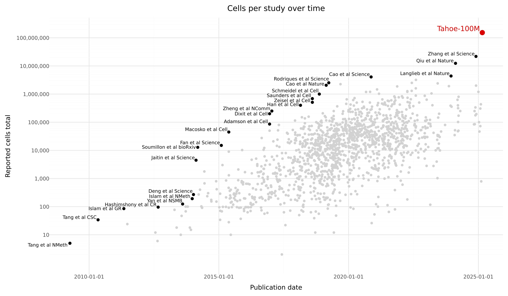
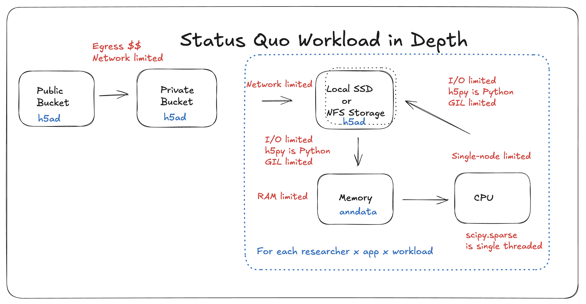
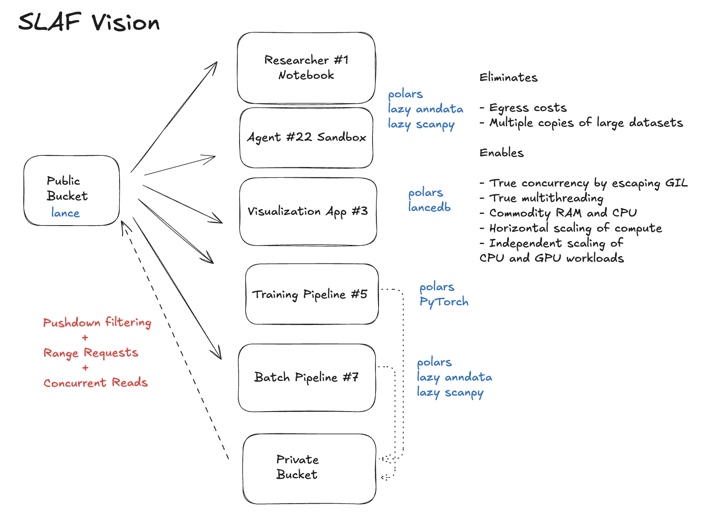
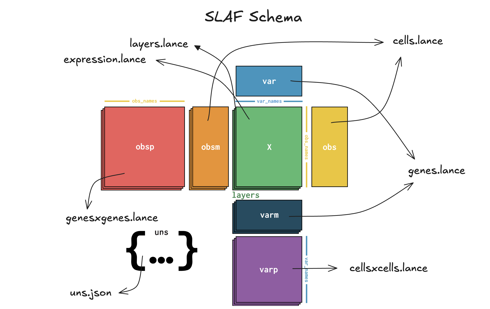
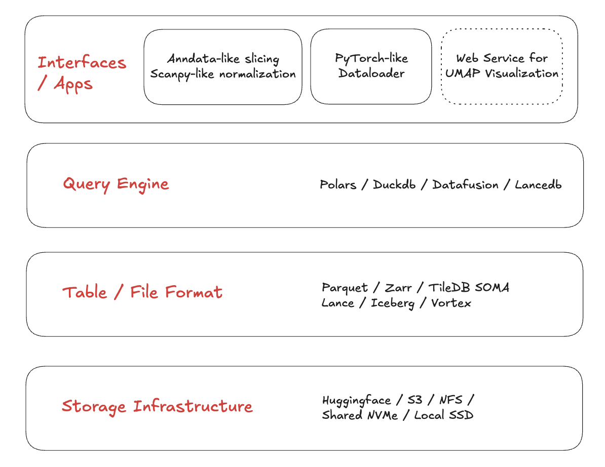
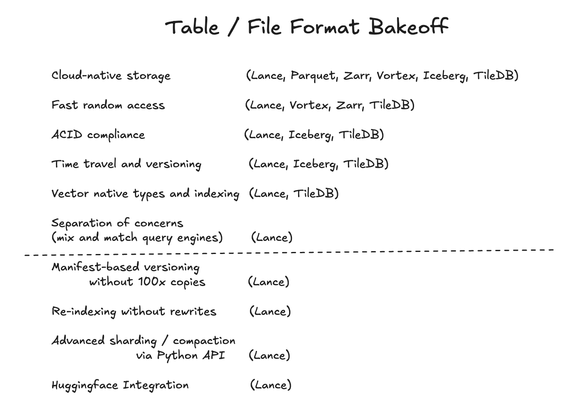

# Betting on Lance

_How a storage format decision became the foundation for AI on single-cell genomics atlases_

By the time I started building SLAF, I had already learned this lesson once: when your data format no longer matches your workload, every downstream system turns into a bottleneck. Formats evolve with workloads. Biology's workloads have changed again. I learned it first in high-content microscopy. I learned it again in single-cell genomics. And in both cases, the fix was to rethink storage for the next era of scale.

This post is about why I bet SLAF's future on [Lance](https://lance.org/).

---

## Biology's Long Tail of Formats

Biology has never had one canonical data format. It has had eras. Over two decades, each new technology has spawned its own storage format, each optimized for a different era's constraints.

Genomics has FASTA and FASTQ—text-based formats designed when a human genome cost $100 million to sequence, and the world was lucky to have one genome, and the computational algorithms for aligning them to a reference were yet to be invented. Digital microscopy standardized around TIFFs, a format that grew up in desktop publishing and photography, primarily concerned with preserving the best native resolution that imaging hardware could support, not with downstream computation. Likewise, single-cell transcriptomics standardized around H5AD, built on HDF5 groups storing non-zero entries of large sparse matrices to represent gene expression counts across thousands of cells.

These formats share a common origin story: they were designed for a world where data lived on local disks, computation happened in memory on a single machine, and the primary bottleneck was computation, not I/O. With the steady march of Moore's law driving up compute and memory capacity per dollar, that world no longer exists.

Today, datasets live in object storage. Computation happens across distributed clusters. And the bottleneck has shifted from "can we compute this?" to "how quickly can we get this into compute?"

---

## From TIFF Bottlenecks to Cloud-Native Thinking

Before SLAF, I worked on a brain organoid platform at [Herophilus](https://www.herophilus.com/). We developed brain organoids (industrialized mini-brain models) to discover novel medicines for brain disease. Organoids serve as the next best counterfactuals to (hard to obtain) post-mortem patient brain tissue in world where it takes a decade to assemble a 10k sample size post-mortem brain tissue biobank. At peak capacity by comparison, our organoid factory produced 50k mini brains per week. To study their detailed emergent biology, we put them in micro wells and imaged them. Our automated imaging work cells generated high-resolution microscopy at scale: spanning multiple z-stacks, multiple timepoints, multiple fluorescent channels across multiple slides or well plates. We schlepped TIFF files to the cloud, indexed the metadata, and built a data lake to serve diverse workloads.

Data scientists ran exploratory analysis in notebooks. Data engineers build batch analysis pipelines and deployed them on spot instance. ML engineers trained vision models and deployed inference pipelines. Absolutely everybody wanted on-demand visualization. Agents were not yet a thing, but if they were, they would want to be in on all of the above workloads as well.

TIFF became the wall quickly. It worked by copying gigabytes at a time to developer nodes or spot instances, but not for random, concurrent, low-latency access patterns like visualization. So, we forked the format. We built interal JPEG-based image pyramid copies and served them with tile servers to browsers. When we finally migrated to [zarr](https://zarr.dev), a cloud-native chunked storage format for n-dimensional arrays, we saw the same pattern many teams discover: once data is chunk-addressable and remotely readable, whole classes of workflows become practical. We streamed imaging slices to distributed compute for embarassingly parallel workloads that scaled both vertically (across cores) and horizontally (across machines), realizing many storage, latency, throughput and cost-savings multiples across all of them.

That lesson stayed with me.

At Herophilus, we also did single-cell transcriptomics on our organoids, without adopting cloud-native storage. It felt "fine" as late as 2022 because datasets were still manageable with local workflows. Then the scale changed.

---

## The Single-Cell Inflection Point

The average adult has 37 trillion cells, each carrying the 3 billion base pair codebook of the human genome in its nucleus. What makes a cell unique is the genes that are expressed over its lifetime. The abiliy to measure of gene expression (RNA molecules) and proteins in single cells and map their spatial distribution has ushered in unprecedented detail in understanding molecular signatures of cell types and tissue composition, developmental biology: how cells differentiate from stem cells, cancer biology: how cancer cells evade drugs and immune systems, and cell-cell interactions.

Here’s the high-level journey that RNA molecules in our cells make on their way to a count matrix: in droplet-based single-cell RNA-seq, we suspend cells so that (ideally) each droplet captures one cell plus a bead coated with large molecules of nucleotides (oligos). Those oligos encode a **cell barcode** (which droplet/cell this came from), a **UMI** (a molecule tag so duplicates from the polymerase chain reaction (PCR) can be collapsed), and a poly‑T tail that grabs mRNA. Then we deliberately *pool everything*: all droplets, often many samples multiplexed together, go through one sequencing run. The sequencer outputs short reads; we align (or pseudoalign) them to a reference transcriptome/genome, decode the barcodes/UMIs, and count molecules per gene per cell. The end product is the canonical artifact of the field: a huge, extremely sparse count matrix (cells × genes), plus metadata telling you which biological sample, condition, and QC attributes each cell belongs to.

Single-cell datasets have grown 2,000-fold in less than a decade. What used to be 50,000 cells per study as late as 2020 is now 100 million cells in a single release. In February 2025, Tahoe Therapeutics released Tahoe-100M: 100 million transcriptomic profiles measuring drug perturbations across 50 cancer cell lines. It's the world's largest single-cell dataset, 50 times larger than all previously available drug-perturbation data combined. They released it on [Hugging Face](https://huggingface.co/datasets/tahoebio/Tahoe-100M) with this extremely quotable figure. With Illumina announcing a [billion cell atlas](https://www.illumina.com/company/news-center/press-releases/2026/fda84c92-b4b3-4691-a402-35555abe8605.html) project in January 2026, the scaling continues at a rapid clip.

_Figure 1: Cells measured per study over time in single-cell tranascriptomics assays. Image Credit: [Tahoe Therapeutics]((https://huggingface.co/datasets/tahoebio/Tahoe-100M))._

If you're curious about what has driven such scaling, technological innovations in library preparation (transforming cell-specific RNA molecules to barcoded droplets; see [10x Chromium overview](https://10xgenomics.com/support/universal-three-prime-gene-expression/documentation/steps/experimental-design-and-planning/getting-started-single-cell-3-gene-expression)), sequencing (converting RNA fragments to raw base pair reads; see Illumina’s [sequencing-by-synthesis overview](https://www.illumina.com/science/technology/next-generation-sequencing/sequencing-technology.html)), and demultiplexing (computationally reverse engineering sample identity from multiplexed sequencing via genotypes; see [demuxalot](https://www.biorxiv.org/content/10.1101/2021.05.22.443646v1)), along with healthy market competition; see [Alex Dickinson's commentary](https://www.linkedin.com/feed/update/urn:li:activity:7444730282613563392/) on the evolving competitive dynamics in sequencing cost per cent, have conspired to make a new [Carlson curve](https://en.wikipedia.org/wiki/Carlson_curve) for single-cell biology.

From a history-of-ML perspective, this is also the **[bitter lesson](https://www.incompleteideas.net/IncIdeas/BitterLesson.html)** playing out again: qualitative leaps rarely come from clever architectures alone; they come when the dataset gets big enough that general-purpose learning finally has room to work. The recurring pattern is “new dataset release + a model that can actually absorb it = a new era”:

- ImageNet + AlexNet    =       Computer Vision Deep Learning Era
- Common Crawl + GPT‑2  =       LLM Era
- PDB + AlphaFold       =       Modern Protein Structure Era

The open question now is whether we’re watching the same movie in biology: Tahoe‑100M (and what comes after it) + single-cell foundation models = the “virtual cell” era, where representation learning over atlases becomes a primitive as foundational as alignment or clustering.

What does this ambition translate to in terms of computational appetite?

1. Existing local-file workflows become operationally expensive.
2. New workloads (foundation model training, embedding retrieval, atlas distribution) require capabilities the old formats did not prioritize.

The status quo workflow for single-cell data looks something like this: download terabytes from a public bucket to your own bucket, then to local storage, load or stream it into memory, transform it into library-specific in-memory formats. Limitations surface in the form of various ceilings: egress costs, network throughput, local storage capacity, finite RAM per node, as well as various design decisions that leave gains on the table: single-threaded I/O, single-threaded compute, underutilized CPU cores, overprovisioned GPU clusters.

_Figure 2: Status quo single-cell transcriptomics workload in depth._

---

## What Breaks in the Status Quo

H5AD (HDF5-backed sparse arrays) remains a great format for many local analysis workflows. But at atlas scale and in multi-user/cloud scenarios, failure modes pile up:

- Read amplification problems: Large transfers become a pre-requisite for querying even small slices.
- Egress costs: Teams serving large atlas datasets are paying down egress costs even for random access, compounded by read amplification issues
- Data lineage problems: Teams duplicate entire files per user/job, modify them in-place and spaghettify data lineage.
- Network bottlenecks: Streaming to compute just isn't fast enough, warranting colocated copies of large training corpora near GPU clusters, increasing storage and transfer costs
- I/O bottlenecks: Reading hdf5 groups into Python via `h5py` is GIL-limited and does not provide true concurrency.
- Compute bottlenecks: Manipulating `scipy.sparse` objects in memory is single threaded and wastes ubiquitous, cheap, modern multi-core CPUs.
- GPU costs: As I've written about before, [modern GPUs are voracious](https://slaf-project.github.io/slaf/blog/blazing-fast-dataloaders-2/) and need batches arriving before they have completed a training step. With the wrong storage format, i/o bottleneck, decompression algorithms, GPUs can be idle 90% of their uptime in between useful work(the training step).
- Latency problems: Data visualization dashboards and agents, may require only a sliver of datasets (subset of cells or genes) and are slowed down by huge up-front RAM needs for web services (non-starter) or slow random access from disk (non-finisher).

The issue is not that H5AD is "bad." The issue is mismatch: the format was designed for a different center of gravity than object-store-native, concurrent, streaming, analytical + exploratory + ML workloads.

---

## Two Different Scale Problems

At this point, I found it useful to separate scale issues into two classes.

### Class 1: Existing workloads get harder

PCA/UMAP/QC pipelines, interactive notebooks, and collaborator sharing still exist - they just become operationally fragile and expensive with tens of millions of cells. I've heard from pharma leaders that their time is spent petitioning for budgets to spin up 2TB RAM instances for exploratory, interactive, or analytical work.

### Class 2: Entirely new workloads appear

- atlas-scale open data distribution
- foundation model pretraining/fine-tuning
- large embedding stores and ANN search
- agentic query workflows over biological metadata + expression

The ecosystem's response has been fragmentation: one format for one workload, another for another. That is understandable, and harkens back to what we did at Herophilus for microscopy, but forks teams, and becomes expensive to maintain.

---

## The Core SLAF Vision

The bold vision of SLAF was "Databricks for single cell omics". Store once in a data lake, and stream to every imaginable workload. Instead of the status quo canonical workload, we want to see streaming support for exploratory work, interactive visualization, analytical batch jobs, foundation model training, batch and on-demand inference, all while managing data evolution as a first class citizen throughout this lifecycle.

_Figure 3: The SLAF Vision: Store once, stream everywhere._

SLAF's first major decision was simple but consequential. Represent expression as sparse COO-like records in Lance. Conceptually:

- `expression`: `(cell_id, gene_id, value)` records
- `cells`: cell metadata table
- `genes`: gene metadata table

There are a few additional wrinkles that complete the anndata schema, I won't get into here but as I've written about [before](https://slaf-project.github.io/slaf/blog/introducing-slaf/), this design turns expression into a table-native representation that benefits from all the hard fought victories of the OLAP movement over the past decade: columnar compression, bloom filters, shard-aware query plans, pushdown and projection pre-filtering, optimized joins, and streaming batch reads.

The implications for large sparse single cell count data:

- store only non-zero observations
- keep metadata queryable in-column
- read only what a workload actually needs

_Figure 4: SLAF's schema is the anndata schema reimagined as a collection of lance tables._

With this schema in place, there were decisions to be made about where Lance as a table format fit into a disaggregated stack for maximum modularity.

_Figure 5: SLAF's modular stack. Composable storage layer, table format, compute engine, and application-specific interfaces._

At the bottom, users pick a storage layer: typically object store, but with [Lance x Hugging Face integration](https://lancedb.com/blog/lance-x-huggingface-a-new-era-of-sharing-multimodal-data/), a bonus option is to store SLAF data in a Hugging Face datasets repo, [as I have done](https://huggingface.co/slaf-project) for a few bellwether single-cell Atlas datasets in the field.

---

## Why Lance Specifically

The boring answer is “performance.” The real answer is “**one format contract that stays coherent when you smash five workloads together**.”

When I evaluated modern formats that are already cloud-native and shard-aware (Parquet + Iceberg, TileDB, Zarr, Vortex), most of them were *very* strong on one or two axes. But SLAF needed the full bundle below, in roughly this order:

1. **Cloud-native storage**: the same dataset should work locally and on object storage without a bespoke serving layer.
2. **Fast random access**: both analytics-style scans *and* “give me these specific rows/cells” should be cheap.
3. **ACID-ish correctness properties**: multiple writers, append-heavy workflows, and a path to safe evolution.
4. **Time travel and versioning**: atlases evolve; users need stable snapshots and reproducibility.
5. **Vector-native types and indexing**: embeddings aren’t an add-on anymore - they’re a primary artifact.
6. **Separation of concerns**: I want to mix-and-match query engines without rewriting storage or sacrificing pushdown.

And then, below the line, the “this is what actually makes it livable at atlas scale” features:

7. **Manifest-based versioning without 100x copies**: update metadata and schemas without rewriting the world.
8. **Re-indexing without rewrites**: add or rebuild indexes as data and workloads evolve.
9. **Advanced sharding / compaction via Python API**: control the physical layout as a first-class lever.
10. **Hugging Face integration**: distribution is a workload; make it frictionless.

Lance was the first format where I didn’t have to pick which workloads to disappoint.

_Figure 6: Lance vs X._

---

## Lance by Workload

This is where the choice stopped being abstract and started being operational.

!!! info "Atlas distribution and public hosting"

    At atlas scale, “download the dataset, then query it” is no longer the default interaction model - it’s the failure mode.

    A useful format needs:

    - column projection (ship only what you ask for)
    - predicate pushdown (skip irrelevant data early)
    - concurrent reads over object storage
    - evolution/versioning that doesn’t imply full rewrites

    **Sharp contrast:** Parquet is an excellent interchange/warehouse format, but the moment you need *table semantics* (versioning, evolving indexes, reproducible snapshots) you end up depending on an external table layer (e.g. Iceberg) and then still having to reconcile “analytics scans” with “random access to specific rows” as first-class operations. Lance is designed to make both patterns native in one artifact.

!!! info "Batch processing pipelines"

    Large biological jobs are often embarrassingly parallel if your storage unit aligns with your compute shard.

    Fragment-oriented reads enable straightforward work partitioning:

    - assign fragments (or fragment ranges) to workers
    - stream Arrow batches
    - keep compute ephemeral and close to object storage

    **Sharp contrast:** Zarr shines when the primitive is an \(N\)-D array chunk, but single-cell workloads aren’t just “slice an array” - they’re “filter, join, aggregate, and then slice.” TileDB does have table capabilities, but for SLAF the hard part is the table-format ergonomics at atlas scale: append and evolve without proliferating copies, plus fine-grained control over physical sharding/compaction from Python. That combination ended up feeling substantially more mature in Lance.

!!! info "Foundation model training data loaders"

    The training bottleneck is frequently not model math - it’s data delivery.

    The old pattern creates multiple full copies:

    1. canonical scientific file
    2. training-optimized derivative
    3. temporary job-local copies

    Lance’s fragment layout and Arrow-native batch streaming make it natural to build shard-aware prefetchers that keep GPUs fed *directly from the lake artifact*.

    **Sharp contrast:** most modern cloud-native formats are “streamable” in the trivial sense. The differentiator for training is whether streaming is *prefetch-first*: Lance’s async I/O and prefetching under the hood make shard-aware dataloader prefetchers almost boring to build, whereas many other formats leave you reinventing the I/O scheduling layer (and its performance traps) in user code.

    **[Figure Placeholder F5: Optimized dataloader pipeline (storage -> prefetch -> transform -> queue -> GPU)]**

    **[Table Placeholder T1: Throughput comparison (SLAF vs baselines)]**

!!! info "Inference and embedding management"

    Single-cell pipelines are increasingly embedding-first. You need to:

    - write embedding vectors at scale
    - query neighbors quickly
    - join ANN results back to cell metadata and expression-derived features

    **Sharp contrast:** formats like Vortex are starting to move in this direction, but “store a vector column” isn’t the same as “a table format with ACID-ish semantics and first-class vector indexes.” Treating vectors as first-class columns with native indexing is the difference between “I can save embeddings” and “I can build retrieval-native biology workflows.”

!!! info "Interactive visualization"

    Visualization rarely needs the full expression payload. It needs selective projections (coordinates + labels + small metadata windows) with low latency.

    **Sharp contrast:** formats optimized for bulk scans can still be painful for interactive sampling if random access and nearest-neighbor lookups aren’t first-class design constraints. In practice, a good web experience often means predictive prefetch: as a user hovers/filters/zooms, the service prefetches the points they’re likely to click next via ANN search at interactive speeds. That loop only works if your storage layer supports fast random access *and* vector indexes.

---

??? question "FAQ: “But why not Parquet / Iceberg / Zarr / TileDB / Vortex?”"

    **Why not Parquet for everything?**
    Parquet is fantastic for columnar scans and interoperability. The pain starts when you need *both* high-throughput scans *and* fast random access patterns, while also evolving the dataset (indexes, versions, schema) in a way that stays ergonomic for iterative ML + analytics + interactive use.

    **Why not Iceberg (with Parquet) for table semantics?**
    Iceberg is a strong table layer, but SLAF also needs a storage artifact that is shard-aware and stream-friendly for ML data loading and for interactive sampling, not just “queryable by engines that speak Iceberg.” The question isn’t whether Iceberg works - it’s whether the full stack stays simple when you add embeddings, ANN search, and training throughput as first-class requirements.

    **Why not Zarr for chunked access?**
    Zarr is great when the core object is an \(N\)-D array and your access is mostly chunk slicing. SLAF’s core object is a sparse observation table + rich metadata + embeddings, and the workloads are dominated by filter/join/aggregate patterns where table semantics and pushdown matter as much as chunking.

    **Why not TileDB?**
    TileDB is a serious system, and it does have table capabilities. For SLAF, the differentiators ended up being table-format ergonomics at atlas scale: append/evolve without proliferating copies, plus fine-grained, Python-level control over sharding/compaction, while keeping random access, versioning, and vector-native behavior on the same contract.

    **Why not Vortex (or scan-optimized formats) for analytics?**
    Scan performance is necessary but not sufficient. SLAF has to serve analytics, ML training, interactive exploration, and embedding retrieval from the same canonical artifact. Vortex is compelling on compression and scan speed, but SLAF also needs table-format semantics (ACID-ish evolution + time travel) and vector indexing as first-class features, not bolt-ons.

---

## Familiar Interfaces, Different Internals

Most users should not care about the underlying format if the UX is familiar.

A biologist should still be able to write something that feels like existing workflows in their library of choice (`scanpy`). A ML engineer should still get a DataLoader interface that behaves like `PyTorch`.

What changes is the execution plan:

- push filtering to storage
- stream batches lazily
- avoid loading irrelevant payloads
- keep one canonical artifact for many workloads

This is how infrastructure wins: by disappearing behind stable interfaces.

---

## What Comes Next

The roadmap from here is less about one benchmark and more about ecosystem shape:

- robust multi-node training integrations
- production-grade embedding lifecycle management
- deeper GPU-accelerated query/dataframe paths
- spatial transcriptomics support
- cleaner interoperability bridges for existing single-cell tools

The larger goal is straightforward: one format contract that keeps biology data usable as scale continues to grow.

---

## Closing: Why I Bet on Lance

If we want atlas-scale biology to be broadly usable, and not just by teams with dedicated infrastructure engineers, we need storage choices that make the common path fast, composable, and cloud-native by default.

For SLAF, betting on Lance was that choice. I chose it because I needed a foundation that could survive workload convergence:

- analytics
- model training
- inference
- embeddings
- interactive exploration

without forcing format fragmentation or constant data duplication. In practice, Lance was the first format where the architecture felt like the future instead of a patch over the past.

# TODOs
- Describe how queries are optimized and report query performance benchmarks with links to SLAF benchmarks
- Describe how the dataloader innovations work, with references to precedent literature. Compare agains PyTorch and Ray ecosystems. Report dataloader metrics
- Describe the consequences of bleeding edge dataloaders for the field. How GPU utilization and shorter wall clock training times can lead to intra-day training episodes for foundation models and drive more shots on goal per unit time and budget per research team. Link to fast-scGPT blog post.
- Code snippets
- Clean up roadmap section
