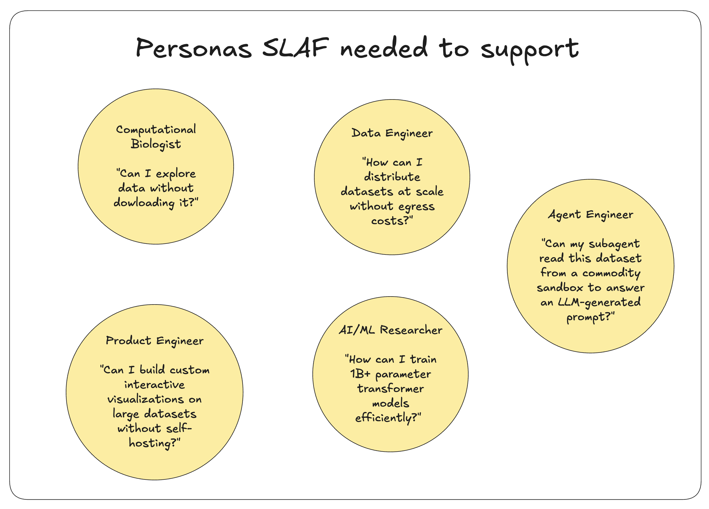
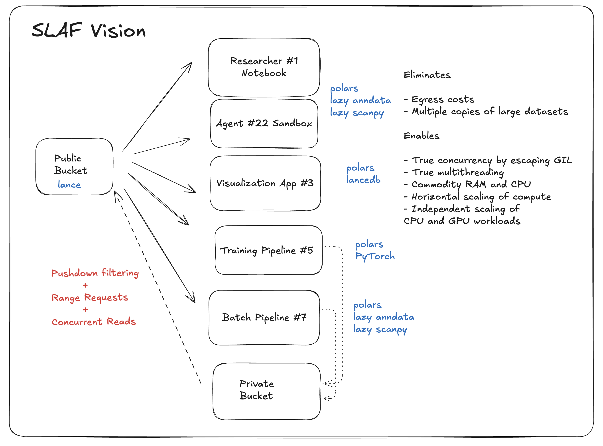

# SLAF on Hugging Face

---

We're excited to share that **SLAF datasets are now freely available and streamable on Hugging Face** 🎉

1. Three open single-cell transcriptomics datasets in SLAF format are live at [huggingface.co/slaf-project](https://huggingface.co/slaf-project).

2. These datasets are streamable directly from the Huggingface Hub to your compute for exploratory analysis, batch processing, or training without bulk downloads.

If you work with 10M+ cell datasets, you've hit the ceiling of "download the h5ad and load it in memory." SLAF on Hugging Face is the alternative: same workflows, streamed from the Hub. Beyond single-cell, the [lance-format org](https://huggingface.co/lance-format) is already hosting Lance across text, image, video, and robotics today.

---

## First, the datasets

We're releasing three popular datasets spanning different biology and scale in SLAF format:

| Source                 | Scale      | Repo                                                                        | Description                                                  |
| ---------------------- | ---------- | --------------------------------------------------------------------------- | ------------------------------------------------------------ |
| **Tahoe Therapeutics** | 100M cells | [Tahoe-100M](https://huggingface.co/datasets/slaf-project/Tahoe-100M)       | Chemical perturbation screen on 50 cancer cell lines         |
| **Parse Biosciences**  | 10M cells  | [Parse-10M](https://huggingface.co/datasets/slaf-project/Parse-10M)         | Cytokine-stimulated PBMCs across multiple donors             |
| **Xaira Therapeutics** | 6M cells   | [X-Atlas-Orion](https://huggingface.co/datasets/slaf-project/X-Atlas-Orion) | Genome-wide deeply sequenced CRISPR screen on two cell lines |

Point your code at a `hf://datasets/slaf-project/<repo>` URI and stream.

!!! warning "Licenses"

    Note that Tahoe is the most permissive license, whereas Parse and Xaira are free to use or reshare with attribution for non-profit use. Specific licenses and links to original versions are available in the repos.

!!! tip "Heed the rate limits"

    Lance can read directly from Hugging Face's backend for free, subject to rate limits. We've currently hosted these datasets on a Pro Plan but can upgrade to better rate limits or help you host your favorite datasets on your private repo depending on usage.

---

## The Status Quo and Who We're Building For

Before we get into how streaming works, it helps to see what we're moving away from and who we're building for.

**The problem.** The status quo for large single-cell (and many other) datasets is: copy from a public bucket to your own, then pull into local storage, load into memory with format-specific readers, and hit the usual limits: egress cost, network throughput, I/O concurrency underutilization due to the Python GIL, RAM ceilings, and libraries that perform single-threaded ops. Every researcher, app, and workload often ends up with their own copy and pipeline.


_Figure 1: Status quo workload in depth._

**Who we're building for.** SLAF is designed for multiple personas: computational biologists who want to explore data without bulk downloads, data engineers who need to distribute at scale without egress blow-up, AI/ML researchers training large models efficiently, product engineers building interactive visualization on big data without self-hosting, and agent engineers who need subagents to read from a commodity sandbox. Those are exactly the personas that benefit from "point at `hf://`, stream, don't download."



_Figure 2: Personas SLAF needed to support._

---

## Lance + Hugging Face: Stream to Your Compute

Hugging Face has invested heavily in **streaming at scale**: fewer startup requests, faster resolution, and an [fsspec-compatible `hf://` filesystem](https://huggingface.co/docs/huggingface_hub/guides/hf_file_system) so that any fsspec-capable library can read from the Hub without a full download. Lance's **`hf://`** support plugs into that: a Lance dataset can live on the Hugging Face Hub and be opened like this:

```python
import lance
ds = lance.dataset("hf://datasets/slaf-project/Parse-10M/data/train/cells.lance")
for batch in ds.to_batches(batch_size=256):
    # process batch (PyArrow RecordBatch)
    ...
```

A URI and an iterator without `huggingface-cli download` makes it possible to run **exploratory analysis**, **batch jobs**, and **training jobs** directly from Hugging Face, subject to plan-specific rate limits.

---

## Three Ways to Use the Data

### 1. Exploratory analysis with SQL

Use SLAF's SQL layer to filter and aggregate over the dataset without loading it into memory. Example (from the [Hugging Face README](https://huggingface.co/slaf-project)):

```python
from slaf import SLAFArray

slaf_array = SLAFArray("hf://datasets/slaf-project/Parse-10M")
results = slaf_array.query("""
    SELECT
        cytokine,
        cell_type,
        AVG(gene_count) as avg_gene_count
    FROM cells
    WHERE donor = 'Donor10'
      AND cytokine IN ('C5a', 'CD40L')
    GROUP BY cytokine, cell_type
    ORDER BY cytokine, avg_gene_count DESC
""")
```

Queries are executed with predicate and projection pushdown against the Lance tables on the Hub; only the columns and rows needed for the result are streamed.

### 2. Batch processing (streaming scans)

For full-table or large scans (e.g. normalization, aggregation, export), you can stream batches from Hugging Face and process them in a pipeline. We benchmarked streaming from **three sources**:

- the **Hugging Face Hub** (dataset repo),
- an **S3 bucket in the same availability zone** as the worker,
- and a **colocated Modal volume** (data local to the worker).

For the Hugging Face source we compared the **Datasets library's native streaming** (`load_dataset(..., streaming=True)`) with **Lance over `hf://`** (same repo, same table). The S3 and Modal volume runs use Lance only, as reference points for same-region object storage and colocated NFS-like store.

We streamed **~5.12M records** from the Tahoe-100M cells table (batch size 256 × 20,000 batches) to a Modal worker:

```
Throughput (MiB/s)
─────────────────────────────────────────────────────────
Modal volume (lance)   ████████████████████████████████ 189.72
Tigris S3 (lance)      ██████████ 62.06
HF repo (lance)        ███████ 44.84
HF repo (datasets)     █████ 29.53
─────────────────────────────────────────────────────────
                       0    50   100   150   200
```

!!! success "Takeaways"

    **Lance over `hf://`** is **~1.5× faster** than the Datasets library's native streaming on the same HF repo (44.84 vs 29.53 MiB/s).

    Note that the [Hugging Face team has invested in several optimizations for Parquet streaming](https://huggingface.co/blog/streaming-datasets) (e.g. persistent file-list cache, prefetching, configurable buffering), which have made `load_dataset(..., streaming=True)` much more efficient for Parquet-backed datasets. The same level of tuning is not yet in place for Lance in the Datasets library. Small improvements there could likely bring Datasets streaming to parity with Lance over `hf://` for Lance-backed repos. Meanwhile, for batch processing or training jobs that stream from the Hub, Lance's `hf://` support gives you a meaningful throughput gain over Datasets streaming without leaving the Hugging Face ecosystem.

    Same-region S3 (Tigris) with Lance is faster still (62.06 MiB/s), and a colocated Modal volume gives the highest throughput (189.72 MiB/s), as expected when data is local to the worker.

### 3. Dataloading for training (SLAFDataLoader)

For foundation-model-style training on tokenized cell sentences, use `SLAFDataLoader` with an `hf://` SLAF dataset so batches are streamed from Hugging Face, randomized and tokenized on the fly:

```python
from slaf import SLAFArray
from slaf.ml.dataloaders import SLAFDataLoader

slaf_array = SLAFArray("hf://datasets/slaf-project/Parse-10M")
dataloader = SLAFDataLoader(
    slaf_array=slaf_array,
    tokenizer_type="geneformer",
    batch_size=32,
    max_genes=2048,
    vocab_size=50000,
    prefetch_batch_size=1_000_000
)
for batch in dataloader:
    input_ids = batch["input_ids"]
    attention_mask = batch["attention_mask"]
    # Your training code here
```

Same API as with a local or S3 path; only the URI changes. The dataloader's prefetcher and tokenization run on the stream coming from the Hub.

---

## One Store, Many Consumers: The SLAF Vision

The three use cases above: exploratory data analysis, batch processing, and training, all point at the same `hf://` datasets and stream only what they need. That's the SLAF vision operationlized: one public store (Lance in a bucket or on the Hub) feeding many consumers: researcher notebooks (Polars, LazyAnnData), training pipelines (Polars, SLAFDataLoader, PyTorch), visualization apps (Polars, LanceDB), batch pipelines, and agent sandboxes. That architecture eliminates repeated egress and duplicate copies, and enables true concurrency, multithreading, commodity RAM/CPU, and independent scaling of compute. Hugging Face is one of the ways we get that "public bucket" in front of everyone: same datasets, same `hf://` path, streamed on demand.



_Figure 3: The SLAF vision: one store, many consumers._

Putting SLAF on the Hub brings that vision closer: streaming from a central, well-known store without bulk downloads, so more of these workloads can run against the same data the same way.

---

## How This Happened: The Backstory

Lance-on-HuggingFace didn't happen in a vacuum. It sits on top of Hugging Face's investment in **streaming at scale** and their **fsspec-compatible `hf://` filesystem**, starting with a concrete use case: making Lance (and SLAF) readable from the Hub without downloading hundreds of GB.

### The Hugging Face side: streaming and the `hf://` filesystem

Hugging Face has been on a tear with **streaming datasets**. In their October 2025 post [_Streaming datasets: 100× More Efficient_](https://huggingface.co/blog/streaming-datasets), they detailed the problem: at scale, _every_ DataLoader worker used to initialize the dataset on its own, hammering the Hub with **100,000+ requests per minute** and getting IPs blocked. Their solution: a **persistent file-list cache** (so only the first worker hits the Hub, the rest share) plus **smarter resolution logic**, cutting startup requests by as much as **100×**, making resolution **10× faster**, and _doubling_ streaming throughput. Now Hugging Face trains nanoVLM by streaming from the Hub, getting performance that rivals reading from local SSDs 🤯

For **custom formats** (like Lance), they didn't leave you with only `load_dataset(..., streaming=True)`. They improved the **[HfFileSystem](https://huggingface.co/docs/huggingface_hub/guides/hf_file_system)** in `huggingface_hub`: an **fsspec-compatible** interface so that any library that speaks fsspec can read from the Hub using the **`hf://`** URI scheme. From the docs:

```python
from huggingface_hub import HfFileSystem

path = f"hf://datasets/{dataset_id}/{path_in_repo}"
with HfFileSystem().open(path) as f:
    # stream with .read() / .readline(), or random access with .seek()
```

The [documentation](https://huggingface.co/docs/huggingface_hub/guides/hf_file_system) spells it out: _"The HfFileSystem can be used with any library that integrates fsspec, provided the URL follows the scheme."_ That's how Pandas, Dask, Polars, DuckDB, and Zarr already work with the Hub, and how Lance now plugs in.

### How Lance and OpenDAL fit in

Our side started with a [**GitHub issue**](https://github.com/huggingface/datasets/issues/7863) asking whether the `datasets` library could stream **Lance** and other modern table formats stored on the Hugging Face Hub so that SLAF (and others) could serve large tabular/scientific datasets in **Lance** format without full-dataset downloads.

That led to collaboration across several projects:

- **Hugging Face**'s work on streaming and the fsspec-compatible filesystem meant that Lance's access patterns (range requests, listing, etc.) already had a solid, documented foundation to build on.
- **OpenDAL** (the unified data access layer Lance uses for cloud I/O) added a Hugging Face backend ([#6801](https://github.com/apache/opendal/pull/6801) feat(hugginface): allow specifying huggingface endpoint), so `hf://` URIs resolve to the Hub and Lance can read from it.
- **Lance** added support for the **`hf://`** URI scheme ([#5353](https://github.com/lance-format/lance/pull/5353) feat: add huggingface native support), so `lance.dataset("hf://datasets/org/repo/path/to/table.lance")` works against the same Hub storage and CDN that HfFileSystem uses.
- **Lance** and **Hugging Face** then worked together to integrate Lance into the datasets repo for automated discovery, display, and native streaming ([#7913](https://github.com/huggingface/datasets/pull/7913) Add lance format support, [#7950](https://github.com/huggingface/datasets/pull/7950) Add examples for Lance datasets, [#7964](https://github.com/huggingface/datasets/pull/7964) handle blob lance, [#7966](https://github.com/huggingface/datasets/pull/7966) Infer types from lance blobs, [#7969](https://github.com/huggingface/datasets/pull/7969) Count examples in lance).

!!! success "Community-driven integration"

    The integration was driven by a concrete use case (SLAF on the Hub), implemented in Lance and OpenDAL on top of Hugging Face's streaming and HfFileSystem work, and validated with Hugging Face's team. We're super grateful to everyone who helped make `hf://` a first-class path for Lance.

For more context, see Hugging Face's [Streaming datasets: 100× More Efficient](https://huggingface.co/blog/streaming-datasets) and the [Interact with the Hub through the Filesystem API](https://huggingface.co/docs/huggingface_hub/guides/hf_file_system) guide.

---

## Beyond Single-Cell Genomics: What Lance on Hugging Face Means for AI/ML

Lance-on-HuggingFace isn't just for single-cell genomics or SLAF. The [**lance-format** org on Hugging Face](https://huggingface.co/lance-format) already hosts Lance datasets across modalities, all streamable via `hf://`:

- **Long-form text**: [fineweb-edu](https://huggingface.co/datasets/lance-format/fineweb-edu) (1.5B+ rows) and other tabular text datasets for pretraining and fine-tuning.
- **Images**: [laion-1m](https://huggingface.co/datasets/lance-format/laion-1m) and similar image (and image–text) collections with optional embeddings and vector search.
- **Video**: [openvid-lance](https://huggingface.co/datasets/lance-format/Openvid-1M) and related video datasets for multimodal training.
- **Robotics**: [lerobot_xvla-soft-fold](https://huggingface.co/datasets/lance-format/lerobot_xvla-soft-fold) and other robotics traces in Lance format for imitation and foundation models.

The pattern is the same everywhere: **publish once on the Hub, point Lance (or SLAF) at `hf://`, stream only what you need.** That reduces duplication, speeds up iteration, and makes it easier to run large-scale training and batch jobs from a central, well-known platform.

### Future workloads: embeddings, vector search, and "update rarely"

The integration also opens the door to emerging AI/ML workloads on SLAF's roadmap: embedding data management, multimodal data apps, and low-latency vector search; all with the same "store on the Hub, stream to your compute" idea.

**Embedding data management.** Suppose you want scGPT or Transcriptformer embeddings on your private dataset. You can run batch inference pipelines directly off Lance on Hugging Face: stream cells from `hf://`, compute embeddings via serverless [Inference Endpoints](https://huggingface.co/inference-endpoints) or [Hugging Face Jobs](https://huggingface.co/docs/huggingface-jobs) on Hugging Face compute, and write results back into Lance tables on the Hub. You can mix and match inference, batch compute, and storage to your preferred alternatives to Hugging Face; the common thread is Lance and streaming, with Hugging Face making the plumbing convenient.

**Apps that need vector search.** Suppose you want a data app that uses nearest-neighbor search on embeddings to interactively apply cell typing to a new private dataset. Store embeddings in Lance tables on the Hub, attach a vector index (e.g. via [LanceDB](https://lancedb.com/)), and stream search results to your app. No need to download the full table or run your own vector store.

**Upgrading embeddings without 100× copies.** When a new version of a third-party embedding model ships, you don't have to clone the dataset and re-embed everything. In Lance, adding a new embedding version is just a new column in your table on Hugging Face; you backfill only that column and leave the rest of the data untouched. That shifts the vision from **"store once, stream everywhere"** to **"store once, update rarely, stream everywhere"**, where "update rarely" is exactly this kind of inference-endpoint–driven embedding lifecycle.

### What this unlocks for Lance and Hugging Face

For **Lance**, the integration opens a new distribution channel: teams that already distribute multimodal datasets or embeddings on the Hub represent a beachhead, and Lance can expand into managed offerings and richer tooling for such teams. For **Hugging Face**, it strengthens a path to stickiness around end-to-end AI/ML workloads: not just data distribution, but streaming, [distributed training on HF compute](https://huggingface.co/docs/huggingface-jobs), batch inference, open vector and multimodal data lake use cases, and hybrid search applications via LanceDB and Lance. We're super excited to see how both ecosystems evolve.

For the broader Lance × Hugging Face story including multimodal blobs, vector search, and training-friendly storage, see LanceDB's post [**Lance × Hugging Face: A New Era of Sharing Multimodal Data on the Hub**](https://lancedb.com/blog/lance-x-huggingface-a-new-era-of-sharing-multimodal-data/).

We're excited to see how the community uses Lance and SLAF on Hugging Face and eager to expand support for more datasets.

---

**Single-cell folks:** Try [Parse-10M](https://huggingface.co/datasets/slaf-project/Parse-10M) or [Tahoe-100M](https://huggingface.co/datasets/slaf-project/Tahoe-100M) from the Hub this week: point `SLAFArray` or `read_slaf` at `hf://datasets/slaf-project/<repo>` and run a query or a training loop without downloading. Install: `pip install slafdb[ml]`. For more, see the [SLAF documentation](https://slaf-project.github.io/slaf/) and the [slaf-project org on Hugging Face](https://huggingface.co/slaf-project).
